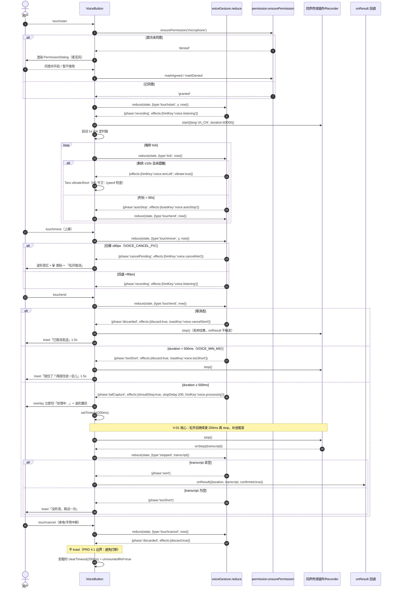
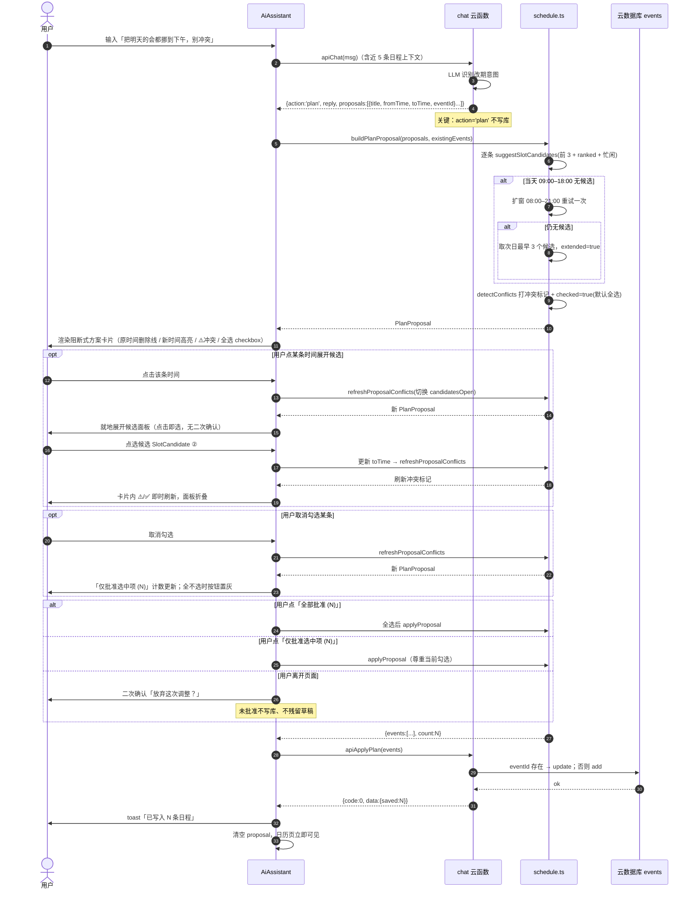
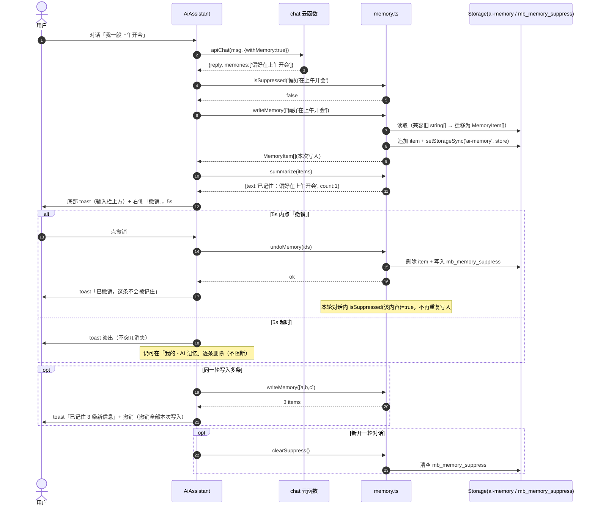
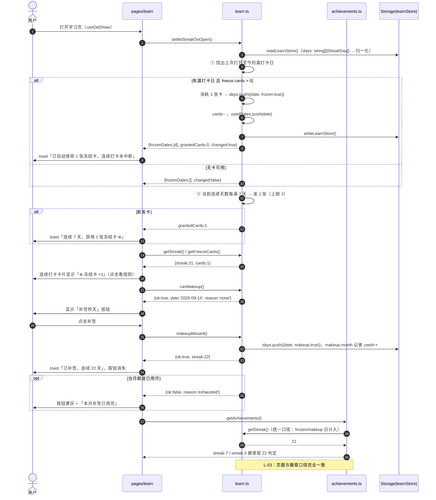
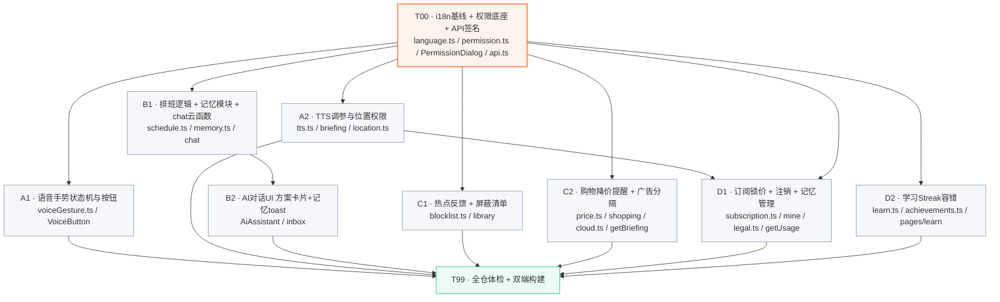

# 增量架构设计 v1.2 · 私人晨报助理

> 版本：v1.2（基线 v1.1）
> 需求源：`docs/prd-increment-v1.2.md`（31 条：P0 22 / P1 9）
> 技术栈：Taro 3 + React 18 + TypeScript + SCSS + 微信云开发（12 个云函数）；H5 部署 GitHub Pages
> 作者：高见远（架构师）
> 交付硬约束：全仓 `tsc` 0 错误 + `build:h5` 与 `build:weapp` 双端构建通过

---

## 〇、前置核查结论（影响后续所有设计，请先读）

在动手前我对代码做了定向核查，发现 **PRD 中的三处模块指认与代码现状不一致**，本设计一律按**代码现状**落地：

| # | PRD 写法 | 代码现状 | 本设计处置 |
|---|---|---|---|
| 1 | 热点页 = `src/pages/index` | `src/pages/index/` 是**空目录**；热点/收藏页实为 **`src/pages/library/index.tsx`**（app.config tabBar 第 3 项「热点」） | 所有 N-* 需求落到 `src/pages/library/` |
| 2 | 设置页 = `src/pages/settings` | `src/pages/settings/` 是**空目录**；设置项已全部合并进 **`src/pages/mine/index.tsx`**（见其 `// 设置项（自独立设置页合并而来）` 注释块） | 所有「设置页」入口落到 `src/pages/mine/index.tsx` |
| 3 | 订阅页 = `src/pages/subscribe`（未明示） | 订阅区在 `src/pages/mine/index.tsx` 的 `subCard`（PLAN_LIST / handleSubscribe） | B-* 需求落到 `src/pages/mine/index.tsx` |
| 4 | C-02 受影响模块 `src/utils/weather.ts` | `weather.ts` **不做定位**，只做 Open-Meteo 天气查询；真正的定位在 **`src/services/location.ts:11` 的 `Taro.getLocation`**，且 `src/app.config.ts:25-30` 已声明 `scope.userLocation` + `requiredPrivateInfos: ['getLocation']` | **C-02 不能降级为「不申请」**，必须按完整弹窗方案实现；`weather.ts` 不改 |

> ⚠️ **对主理人决策 1（Q10）的反驳**：主理人给的默认值是「若确认无 `getLocation` 调用 → C-02 降级为不申请 + 隐私政策声明」。**核查结果是确有 `getLocation` 调用**，因此 Q10 的降级分支不成立，C-02 按完整方案（独立说明弹窗 + 拒绝后可重弹 + 去设置引导）交付。若仍要降级，需额外删除 `location.ts` 定位调用、`app.config.ts` 权限声明、`briefing` 页定位按钮 —— 属破坏性变更，已列入第七章待明确。

---

## 一、实现方案与选型结论

**一句话结论：沿用现有 Taro 3 + React + TypeScript + SCSS + 微信云开发技术栈，不引入任何新框架、不新增任何第三方 npm 依赖，全部 31 条需求在现有架构内以「参数化 + 状态机化 + 纯函数下沉」方式落地。**

### 1.1 为什么不加新东西

| 候选方案 | 结论 | 理由 |
|---|---|---|
| 引入手势库（如 `@use-gesture`） | ❌ 不用 | V-01~V-04 只需 4 个阈值常量 + 9 状态迁移，自写 60 行纯函数即可，且必须可脱离 React 单测；引入库反而增加 weapp 端包体与兼容风险 |
| 引入状态机库（XState） | ❌ 不用 | 单一 reducer 函数足够，XState 的体积与学习成本在小程序端不划算 |
| 引入 TTS 库 | ❌ 不用 | H5 用 `SpeechSynthesisUtterance`（原生）、weapp 用同声传译插件（已有），只需在 `tts.ts` 加一层参数映射 |
| 引入日期库 | ❌ 不用 | 已有 `dayjs`（前端）与原生 Date（云函数）双轨，现状可满足 |
| 新增云函数 | ❌ 不新增 | 排班落库复用 `chat`（新增 `action='applyPlan'`）、降价提醒复用 `getBriefing`、锁价复用 `getUsage`，均不改文件数 |
| 新增 npm 包 | ❌ 0 个 | 见第六章「依赖清单」 |

### 1.2 架构模式

沿用现有分层，**不新增分层**：

```
页面层  src/pages/*            → 只做渲染与事件分发，不含业务算法
组件层  src/components/*       → 受控组件，算法由 props 注入或 import utils
服务层  src/services/*         → cloud.ts（H5/真机路由）+ api.ts（云函数封装）+ cloudSync.ts
工具层  src/utils/*            → 【v1.2 重点】全部新增业务逻辑必须落这里，且为纯函数/独立模块
数据层  src/data/*             → 15 个 mock 文件（cloud.ts 动态 import 降级链路依赖，禁止删除）
状态层  src/store/*            → zustand：user / theme / uiScale / language
```

**v1.2 新增的三条架构硬约束**（详见第六章）：

1. **算法下沉**：手势状态机、冻结卡结算、价格比对、屏蔽清单、记忆抑制列表 —— 全部是 `src/utils/*.ts` 中可单测的纯函数，页面组件只负责把 DOM 事件转成事件对象喂给它。
2. **类型就近**：v1.2 新增领域类型**一律就近定义在所属 `src/utils/*.ts` 并导出，禁止修改 `src/types/index.ts`**（该文件若被多批次并行修改必然冲突；同时保持 `types/index.ts` 作为跨端共享的稳定契约）。
3. **双轨 API**：录音 / TTS / 震动 / 剪贴板 / 授权 / 定位 —— 每个能力必须写 `isWeapp` 优先分支 + H5 降级分支，禁止只实现一端。

### 1.3 关键难点与对策

| 难点 | 对策 |
|---|---|
| **V-01 微信插件 `stop()` 是同步的，200ms 补录能否真正录进尾音存疑（PRD Q1）** | 按主理人决策走「延迟 200ms 再 stop」；同时把 `TAIL_CAPTURE_MS` 提为 `voiceGesture.ts` 的导出常量，真机验证无效时**只改一个常量 + 一行引导文案**即可降级，不波及组件结构 |
| **C-02 弹窗触发点：`locateCity()` 在 service 层，无法渲染 React 弹窗** | 弹窗下沉为通用组件 `PermissionDialog`（T00 交付），由 `briefing` 页在 `handleLocate` 内先 `await ensurePermission('location')` 再调 `locateCity()`；`location.ts` 内再加一道兜底校验（未同意直接 `return null`），双重保险 |
| **排班「先提议后执行」需要 AI 输出结构化方案** | `chat` 云函数 systemPrompt 增加 `action='plan'` 契约（返回 `proposals[]`，**不写库**）；前端 `buildPlanProposal()` 补齐候选时段与冲突标记；批准后调 `apiApplyPlan` 一次性 upsert |
| **冻结卡「次日凌晨结算」在纯前端无定时器（PRD Q5）** | 惰性结算：`learn` 页 `useDidShow` → `settleStreakOnOpen()` 补算漏打卡日并消耗冻结卡；`getStreak()` 保持纯读不做写操作；结算函数独立可单测 |
| **多批次并行改同一文件必然冲突** | 第五章按「文件互斥」分批；`src/types/index.ts`、`src/store/language.ts`、`src/utils/permission.ts`、`src/components/PermissionDialog/*`、`src/services/api.ts` 这 5 个公共文件全部收归 **T00 前置批次**独占，之后 A/B/C/D 四批只 import 不改 |

---

## 二、文件清单

### 2.1 总表

| # | 文件路径 | 变更类型 | 变更内容 | 需求 ID | 批次 |
|---|---|---|---|---|---|
| 1 | `src/store/language.ts` | 修改 | 新增 v1.2 全量文案 key（zh + en 同步，约 70 组），见附录 A | 全部（i18n 基线） | T00 |
| 2 | `src/utils/permission.ts` | **新增** | 权限记录读写、拒绝计数、弹窗文案常量、`ensurePermission()`（weapp/H5 双轨）、个性化推荐开关读写 | C-01 C-02 C-03 | T00 |
| 3 | `src/components/PermissionDialog/index.tsx` | **新增** | 通用敏感权限说明弹窗（标题 / 正文 / 双按钮 / 去设置引导） | C-01 C-02 | T00 |
| 4 | `src/components/PermissionDialog/index.module.scss` | **新增** | 弹窗遮罩与面板样式 | C-01 C-02 | T00 |
| 5 | `src/services/api.ts` | 修改 | 新增 `apiApplyPlan`（排班落库）、`apiShoppingSetTargetPrice`、`apiShoppingClearTargetPrice`；`ShoppingItem` 增加 `lastNotifiedPrice` | S-01 P-01 | T00 |
| 6 | `src/utils/voiceGesture.ts` | **新增** | 手势状态机纯函数 `reduceVoiceGesture()` + 5 个阈值常量 + 状态枚举 + 测试 | V-01~V-04 | A1 |
| 7 | `src/components/VoiceButton/index.tsx` | 修改 | 接入状态机；200ms 补录、80px 取消、<500ms 判定、60s 上限 + 10s 提醒 + 震动；首次点击走麦克风权限弹窗 | V-01~V-04 C-01 | A1 |
| 8 | `src/components/VoiceButton/index.module.scss` | 修改 | 取消态波形变红、🗑 图标、处理中置灰、倒计时文案 | V-02 V-04 | A1 |
| 9 | `src/utils/tts.ts` | 修改 | `TtsOptions{rate,pitch,scene,gapMs}`、场景音色映射表、块间 300ms 停顿（H5 setTimeout / weapp onEnded 延迟） | V-05 V-06 V-07 | A2 |
| 10 | `src/pages/briefing/index.tsx` | 修改 | `handleAudioToggle` 传入 `scene` + 用户速率；`handleLocate` 前置位置权限弹窗 | V-05 V-07 C-02 | A2 |
| 11 | `src/services/location.ts` | 修改 | `locateCity()` 开头加权限兜底校验（未同意 → `return null`，不弹系统授权） | C-02 | A2 |
| 12 | `src/utils/schedule.ts` | 修改 | 新增 `SlotCandidate` / `PlanProposal` 类型、`suggestSlotCandidates()`（前 3 + ranked + 忙闲）、08:00–21:00 扩窗兜底、次日兜底、`applyProposal()`；保留 `suggestSlots()` 作为兼容薄封装 | S-01~S-04 | B1 |
| 13 | `src/utils/memory.ts` | **新增** | 记忆结构化存储（兼容旧 `string[]`）、写入 / 删除 / 清空 / 开关 / 撤销、短期抑制列表、摘要生成 | M-03 M-04 | B1 |
| 14 | `cloudfunctions/chat/index.js` | 修改 | systemPrompt 增加 `action='plan'` 输出契约（不写库）+ `action='applyPlan'` 落库分支 + 购物场景免责话术纪律与禁语约束 | S-01 P-02 | B1 |
| 15 | `src/components/AiAssistant/index.tsx` | 修改 | 排班方案卡片渲染 + 逐项勾选 + 就地候选面板 + 全部/选中批准；记忆写入 toast + 5s 撤销；购物回复免责条 | S-01~S-03 M-03 M-04 P-02 | B2 |
| 16 | `src/components/AiAssistant/index.module.scss` | 修改 | 方案卡片、候选面板、记忆 toast、免责条样式 | S-01~S-03 M-03 | B2 |
| 17 | `src/pages/inbox/index.tsx` | 修改 | 冲突建议区改用 `PlanProposal` 卡片；`applySuggestion` 改为点选 `SlotCandidate`；保留现有 DraftItem 入库链路 | S-01~S-03 | B2 |
| 18 | `src/utils/blocklist.ts` | **新增** | 屏蔽规则读写（来源 / 话题标签两维度）、命中过滤、恢复、清空 | N-02 N-03 | C1 |
| 19 | `src/pages/library/index.tsx` | 修改 | 反馈条即时反馈（≤200ms）+ 5s 撤销 + 「不再展示此类」半屏选择器；列表按屏蔽清单过滤；右上角「关闭个性化推荐」常驻入口 | N-01 N-02 N-03 C-03 | C1 |
| 20 | `src/pages/library/index.module.scss` | 修改 | 反馈条展开动画、已选态、屏蔽选择器半屏样式 | N-01 N-02 | C1 |
| 21 | `src/utils/price.ts` | **新增** | 价格比对 `evaluatePriceAlerts()`、`shouldNotify()` 去重、`formatAlert()` 文案、已提醒价持久化 | P-01 | C2 |
| 22 | `src/pages/shopping/index.tsx` | 修改 | 心理价位可修改 / 清除；记价后即时比对并提醒；结果区 `isAd` 字段与广告分隔区块预留 | P-01 P-03 | C2 |
| 23 | `src/pages/shopping/index.module.scss` | 修改 | 广告灰底标签、≥16px 分隔与分割线、价位编辑样式 | P-03 | C2 |
| 24 | `src/services/cloud.ts` | 修改 | H5 `getBriefing` 分支注入 `priceAlerts`（复用 `data/getBriefing.ts`） | P-01 | C2 |
| 25 | `src/data/shopping.ts` | 修改 | mock 增加 `setTargetPrice` / `clearTargetPrice` 动作、`lastNotifiedPrice` 字段 | P-01 | C2 |
| 26 | `src/data/getBriefing.ts` | 修改 | mock 晨报增加 `priceAlerts` 字段 | P-01 | C2 |
| 27 | `cloudfunctions/getBriefing/index.js` | 修改 | `aggregate()` 追加 `priceAlerts`（读 `shopping` 集合比对 `targetPrice`）；模板 ID 未配置时跳过订阅消息推送 | P-01 | C2 |
| 28 | `src/utils/subscription.ts` | **新增** | 锁价读写 / 失效判定 / 有效价计算、涨价通知站内信构造与读写 | B-01 B-02 | D1 |
| 29 | `src/pages/mine/index.tsx` | 修改 | 订阅区锁价文案与失效提示；个性化推荐开关；注销三步化 + 15 工作日文案 + 输入校验；记忆管理三入口（说明条 / 逐条删除 / 清空 / 开关）；TTS 语速三档与音色设置项 | B-01 B-02 C-03 C-04 M-01 M-02 V-05 V-07 | D1 |
| 30 | `src/pages/mine/index.module.scss` | 修改 | 常驻说明条、危险按钮（红色文字）、≥12px 间距、锁价区块 | M-01 B-01 | D1 |
| 31 | `src/data/legal.ts` | 修改 | 订阅条款新增「4.x 价格调整与早鸟锁价」；`LEGAL_VERSION` 由 `v1.2-20260912` 递增至 `v1.3-20260915` | B-03 | D1 |
| 32 | `cloudfunctions/getUsage/index.js` | 修改 | 返回 `lockedPrice`（有锁价记录时） | B-01 | D1 |
| 33 | `src/utils/learn.ts` | 修改 | `StreakDay` / `StreakFreeze` / `MakeupRecord` 类型（向后兼容旧 `string[]`）、`settleStreakOnOpen()` 惰性结算、`canMakeup()` / `makeupMissed()`、`getFreezeCards()` | L-01 L-02 L-03 | D2 |
| 34 | `src/utils/achievements.ts` | 修改 | streak 类徽章判定改用 `getStreak()` 统一口径（冻结日 / 补签日计入） | L-03 | D2 |
| 35 | `src/pages/learn/index.tsx` | 修改 | 冻结卡 `❄️ 冻结卡 ×N` 展示与规则说明点击；漏打卡时「补签昨天」按钮与额度用尽置灰 | L-01 L-02 | D2 |
| 36 | `src/pages/learn/index.module.scss` | 修改 | 冻结卡徽标、补签按钮（含 disabled 态）样式 | L-01 L-02 | D2 |

**统计**：修改 28 个文件、新增 8 个文件、`src/types/index.ts` **零改动**、`src/data/` 下 15 个 mock 文件除 `shopping.ts` / `getBriefing.ts` 外全部不动（cloud.ts 降级链路完整保留）。

### 2.2 新增文件的理由（逐个说明，符合最小变更原则）

| 新增文件 | 为什么不能塞进现有文件 |
|---|---|
| `src/utils/voiceGesture.ts` | 主理人决策 5 明确要求手势状态机可单测。塞在 `VoiceButton/index.tsx` 里就无法脱离 React 测试；且 4 个阈值常量需被 QA 回归用例引用 |
| `src/utils/permission.ts` | C-01（麦克风）与 C-02（位置）两套弹窗共用同一套「同意态 + 拒绝计数 + 系统授权双向校验」逻辑；C-03 个性化推荐开关也是同类持久化开关。三处复用，不抽会重复三遍 |
| `src/components/PermissionDialog/index.tsx` + scss | 同上，弹窗 UI 同构（PRD 4.5 明确「位置权限弹窗同构」）。且 `locateCity()` 在 service 层无法渲染页面内弹窗，必须有独立组件由页面挂载 |
| `src/utils/memory.ts` | 现有记忆只是 `mine` 页里的 `string[]` state + 一个 `handleClearMemory`。M-02/M-03/M-04 需要「逐条删除 + 撤销 + 抑制列表 + 开关」，且要被 `AiAssistant`（B2）与 `mine`（D1）**两个批次共同引用** —— 必须有独立模块作为两批的唯一契约面 |
| `src/utils/blocklist.ts` | N-02（写入）/ N-03（管理）分别在热点页与「我的」页两个不同批次（C1 / D1）使用，命中过滤逻辑必须单一来源 |
| `src/utils/price.ts` | P-01 的比对与去重逻辑要同时被 `shopping` 页（C2）、`cloud.ts` H5 分支（C2）、`getBriefing` 云函数（C2）使用；云函数侧是 JS 需按同规则重写一遍，此处给出明确算法契约 |
| `src/utils/subscription.ts` | B-01/B-02 的锁价状态要被 `mine` 页（D1）读写、`getUsage` 云函数返回，且「主动取消后失效」是纯业务规则，必须可单测 |

### 2.3 明确不改的文件（避免误伤）

- `src/types/index.ts` —— **零改动**（v1.2 类型就近定义在 utils，见第六章约定 C）
- `src/utils/weather.ts` —— 不改（它不做定位，C-02 的真实触点在 `services/location.ts`）
- `src/data/` 下除 `shopping.ts`、`getBriefing.ts` 外的 13 个 mock 文件 —— 不改（`cloud.ts` 的 `import('../data/${name}')` 动态降级链路依赖它们）
- `src/app.config.ts` —— 不改（`requiredPrivateInfos: ['getLocation']` 与 `permission.scope.userLocation` 已声明，C-02 补齐说明弹窗即可，无需改声明）
- `src/services/cloudSync.ts` —— 不改（新增 key 暂不上云，v1.3 再统一）

---

## 三、数据结构与接口

### 3.1 类图（关键类型与关系）

```mermaid
classDiagram
    class VoiceGestureState {
        +VoicePhase phase
        +number startY
        +number startAt
        +boolean tailTimer
    }
    class VoiceEvent {
        +string type
        +number y
        +number now
    }
    class VoiceEffects {
        +boolean shouldStop
        +number stopDelay
        +boolean discard
        +string toastKey
        +string hintKey
        +boolean vibrate
    }
    class voiceGesture {
        <<module>>
        +reduceVoiceGesture(state, event) VoiceResult
        +VOICE_MIN_MS number
        +VOICE_MAX_MS number
        +VOICE_TAIL_MS number
        +VOICE_CANCEL_PX number
    }
    class VoiceButton {
        -VoiceGestureState gState
        -any plugin
        -any recorder
        +onTouchStart()
        +onTouchMove()
        +onTouchEnd()
        +onTouchCancel()
    }
    class PermissionRecord {
        +boolean agreed
        +number deniedCount
        +number updatedAt
    }
    class permission {
        <<module>>
        +ensurePermission(kind) Promise~GrantResult~
        +readPermission(kind) PermissionRecord
        +markDenied(kind) PermissionRecord
        +getPermissionCopy(kind) PermissionCopy
        +readPersonalization() boolean
        +setPersonalization(on) void
    }
    class PermissionDialog {
        +PermissionKind kind
        +boolean visible
        +onAgree()
        +onDecline()
    }
    class TtsOptions {
        +number rate
        +number pitch
        +TtsScene scene
        +number gapMs
    }
    class tts {
        <<module>>
        +startSpeak(chunks, options)
        +splitTtsChunks(text) string[]
        +resolveVoiceProfile(scene, override, rate) TtsVoiceProfile
        +TTS_SCENE_PROFILE
    }
    class SlotCandidate {
        +string startTime
        +string endTime
        +Busyness busyness
        +string clashTitle
        +number dayCount
        +SlotReason reason
        +number score
    }
    class PlanProposalItem {
        +string key
        +string title
        +string fromTime
        +string toTime
        +string endTime
        +string eventId
        +ConflictMark conflict
        +boolean checked
        +SlotCandidate[] candidates
        +boolean candidatesOpen
    }
    class PlanProposal {
        +string id
        +string title
        +PlanProposalItem[] items
        +boolean extended
        +string createdAt
    }
    class schedule {
        <<module>>
        +suggestSlotCandidates(start, end, existing, opts) SlotCandidate[]
        +buildPlanProposal(raw, existing) PlanProposal
        +refreshProposalConflicts(p, existing) PlanProposal
        +applyProposal(p) ApplyPayload
        +detectConflicts(candidates, existing) ConflictInfo[]
        +suggestSlots(start, end, existing) string[]
    }
    class MemoryItem {
        +string id
        +string content
        +string createdAt
        +string source
    }
    class MemoryStore {
        +boolean enabled
        +MemoryItem[] items
    }
    class memory {
        <<module>>
        +readMemory() MemoryStore
        +writeMemory(contents) MemoryItem[]
        +deleteMemory(id) void
        +clearMemory() void
        +setMemoryEnabled(on) void
        +undoMemory(ids) void
        +isSuppressed(content) boolean
        +summarize(items) string
    }
    class AiAssistant {
        -PlanProposal proposal
        -MemoryToast toast
        +sendMessage(text)
        +renderPlanCard()
        +approveProposal(scope)
    }
    class BlockRule {
        +string id
        +BlockDimension dimension
        +string value
        +string createdAt
    }
    class blocklist {
        <<module>>
        +readBlockRules() BlockRule[]
        +addBlockRules(rules) void
        +restoreBlockRule(id) void
        +clearBlockRules() void
        +filterBlocked(items) T[]
    }
    class PriceAlert {
        +string itemId
        +string name
        +number price
        +number targetPrice
        +number lastNotifiedPrice
    }
    class price {
        <<module>>
        +evaluatePriceAlerts(items) PriceAlert[]
        +shouldNotify(alert, last) boolean
        +formatAlert(alert) string
        +markNotified(id, price) void
    }
    class StreakFreeze {
        +number cards
        +number grantedAtStreak
        +string[] usedDates
    }
    class MakeupRecord {
        +string month
        +number used
        +string[] dates
    }
    class StreakDay {
        +string date
        +boolean frozen
        +boolean makeup
    }
    class learn {
        <<module>>
        +settleStreakOnOpen() SettleResult
        +getStreak() number
        +canMakeup() MakeupCheck
        +makeupMissed() void
        +getFreezeCards() number
    }
    class LockedPriceInfo {
        +string planId
        +number price
        +string lockedAt
        +boolean active
    }
    class subscription {
        <<module>>
        +lockPrice(planId, price) LockedPriceInfo
        +readLockedPrice() LockedPriceInfo
        +invalidateLock() void
        +getEffectivePrice(planId, base) number
        +pushInboxNotice(n) void
    }

    VoiceButton --> voiceGesture : 调用 reduceVoiceGesture
    VoiceButton --> permission : 麦克风授权
    VoiceButton ..> VoiceEffects : 消费副作用
    VoiceGestureState <.. VoiceButton : 持有
    PermissionDialog <.. permission : 提供文案
    AiAssistant --> schedule : 建/改/批准方案
    AiAssistant --> memory : 写入与撤销
    AiAssistant ..> PlanProposal : 渲染
    PlanProposal *-- PlanProposalItem
    PlanProposalItem *-- SlotCandidate
    schedule ..> SlotCandidate : 产出
    memory ..> MemoryStore
    MemoryStore *-- MemoryItem
    blocklist ..> BlockRule : 产出
    price ..> PriceAlert : 产出
    learn ..> StreakFreeze
    learn ..> MakeupRecord
    learn ..> StreakDay
    subscription ..> LockedPriceInfo
    permission <.. PermissionDialog : 文案来源
```



### 3.2 TypeScript 定义

#### （1）语音手势状态机 —— `src/utils/voiceGesture.ts`（A1）

```ts
/** 录音阈值常量（QA 回归用例直接引用这组常量，改阈值只改这里） */
export const VOICE_MIN_MS = 500;        // V-03：<500ms 判误触
export const VOICE_MAX_MS = 60_000;     // V-04：60s 上限
export const VOICE_TAIL_MS = 200;       // V-01：松手后补录 200ms
export const VOICE_CANCEL_PX = 80;      // V-02：上滑 ≥80px 取消
export const VOICE_WARN_MS = 10_000;    // V-04：剩余 10s 提醒

/** 手势状态（与 PRD 4.1 状态图一一对应） */
export type VoicePhase =
  | 'idle'           // 初始 / 收尾完成
  | 'recording'      // touchstart
  | 'cancelPending'  // touchmove 上移 ≥80px
  | 'tailCapture'    // touchend(≥500ms) 或到 60s：延迟 200ms 后 stop
  | 'sent'           // 转写成功且 ≥500ms
  | 'discarded'      // 取消态松手
  | 'tooShort'       // <500ms 松手 或 转写为空
  | 'autoStop';      // 到 60s

export interface VoiceGestureState {
  phase: VoicePhase;
  /** touchstart 的 clientY（px），用于位移比较 */
  startY: number;
  /** touchstart 时间戳（ms） */
  startAt: number;
}

export type VoiceEvent =
  | { type: 'touchstart'; y: number; now: number }
  | { type: 'touchmove'; y: number; now: number }
  | { type: 'touchend'; now: number }
  | { type: 'touchcancel'; now: number }
  | { type: 'tick'; now: number }                      // 1s 定时器，驱动倒计时/60s 上限
  | { type: 'stopped'; transcript?: string };          // 录音真正停止后回调

/** 由 reducer 产出、由组件执行的副作用（reducer 自身不执行任何副作用） */
export interface VoiceEffects {
  /** 是否需要调用 plugin.stop() / recorder.stop() */
  shouldStop: boolean;
  /** stop 延迟（ms）；0 = 立即（仅 tailCapture 为 200） */
  stopDelay: number;
  /** 是否丢弃结果（不触发 onResult） */
  discard: boolean;
  /** 需要展示的 toast 文案（走 i18n key，不写死中文） */
  toastKey?: 'voice.cancelSent' | 'voice.tooShort' | 'voice.autoStop';
  /** 是否需要轻震动 */
  vibrate?: boolean;
  /** 倒计时文案 key：剩余 10s 时置 voice.tenLeft */
  hintKey?: 'voice.listening' | 'voice.cancelHint' | 'voice.processing'
          | 'voice.autoSending' | 'voice.tenLeft';
}

export interface VoiceResult {
  state: VoiceGestureState;
  effects: VoiceEffects;
}

/** 纯函数状态机：同输入必得同输出，可脱离 React 单测 */
export function reduceVoiceGesture(
  state: VoiceGestureState,
  event: VoiceEvent
): VoiceResult;

/** 便捷：由 (startY, currentY) 判定是否进入取消态 */
export function isCancelDistance(startY: number, currentY: number): boolean;
```

#### （2）权限与合规开关 —— `src/utils/permission.ts`（T00）

```ts
export type PermissionKind = 'microphone' | 'location';

export type GrantResult = 'granted' | 'denied' | 'system-denied';

export interface PermissionRecord {
  agreed: boolean;
  /** 拒绝次数：≥3 不再弹窗，改为轻量提示条 + 去设置 */
  deniedCount: number;
  updatedAt: number;
}

export interface PermissionCopy {
  titleKey: string;   // perm.micTitle / perm.locTitle
  bodyKey: string;    // perm.micBody / perm.locBody
  declineKey: string; // perm.decline
  agreeKey: string;   // perm.agree
  deniedBarKey: string;     // perm.micDeniedBar / perm.locDeniedBar
  repeatDeniedKey: string;  // perm.repeatDenied / perm.repeatDeniedLoc
}

export function getPermissionCopy(kind: PermissionKind): PermissionCopy;
export function readPermission(kind: PermissionKind): PermissionRecord;
export function markAgreed(kind: PermissionKind): void;
export function markDenied(kind: PermissionKind): PermissionRecord;
/** deniedCount < 3 才弹窗；≥3 返回 false（调用方改渲染轻量提示条） */
export function shouldShowDialog(kind: PermissionKind): boolean;

/**
 * 统一授权入口（双端双轨）：
 * - 已同意 → 校验系统授权；weapp 走 Taro.getSetting，系统已拒返回 'system-denied'
 * - H5 无 getSetting/authorize 语义 → 直接返回 'granted'，由浏览器原生弹窗接管
 * - 未同意且 shouldShowDialog → 返回 'denied'，由调用方渲染 PermissionDialog
 */
export async function ensurePermission(kind: PermissionKind): Promise<GrantResult>;

/** weapp: Taro.openSetting；H5: 无能力，返回 false（调用方改提示文案） */
export async function openSystemSettings(): Promise<boolean>;

/** C-03 个性化推荐开关（全局资讯维度，PRD Q8） */
export function readPersonalization(): boolean;   // 默认 true
export function setPersonalization(on: boolean): void;
```

#### （3）TTS 调参 —— `src/utils/tts.ts`（A2，向后兼容）

```ts
/** 场景 → 音色（PRD V-07） */
export type TtsScene = 'briefing' | 'news' | 'learning' | 'night';

export interface TtsVoiceProfile {
  /** 语速 0.9–1.1 */
  rate: number;
  /** 音调（H5 pitch；weapp 无此参数时忽略） */
  pitch: number;
  /** 语言标签 */
  lang: string;
}

export const TTS_RATE_OPTIONS: Array<{ id: 'slow' | 'standard' | 'fast'; rate: number }> = [
  { id: 'slow', rate: 0.9 },
  { id: 'standard', rate: 1.0 },
  { id: 'fast', rate: 1.1 }
];

/** 场景音色映射；夜间判定 22:00–07:00 */
export const TTS_SCENE_PROFILE: Record<TtsScene, TtsVoiceProfile> = {
  briefing: { rate: 1.0, pitch: 1.0, lang: 'zh-CN' },
  news:     { rate: 1.05, pitch: 1.1, lang: 'zh-CN' },
  learning: { rate: 0.9, pitch: 1.0, lang: 'zh-CN' },
  night:    { rate: 0.9, pitch: 0.9, lang: 'zh-CN' }
};

/** 块间静默（PRD V-06）：H5 setTimeout，weapp 用 audio.onEnded 后延时 */
export const TTS_CHUNK_GAP_MS = 300;

export interface TtsSpeakOptions extends TtsCallbacks {
  rate?: number;      // V-05 显式语速，0.9–1.1，缺省取场景
  pitch?: number;
  scene?: TtsScene;   // V-07 场景，缺省 'briefing'
  /** 音色策略：auto=跟随场景 / fixed=用户固定音色 */
  voiceMode?: 'auto' | 'fixed';
  gapMs?: number;     // 缺省 TTS_CHUNK_GAP_MS
}

/** 保持旧签名兼容：第二参仍是 options，onEnd/onError 在原位 */
export function startSpeak(chunks: string[], options: TtsSpeakOptions = {}): void;

/** 解析最终音色：night 场景由调用时刻的小时数决定 */
export function resolveVoiceProfile(
  scene: TtsScene | undefined,
  voiceMode: 'auto' | 'fixed',
  rate?: number
): TtsVoiceProfile;

/** 由 hour 推断场景（22:00–07:00 → night） */
export function sceneByHour(hour: number, fallback: TtsScene): TtsScene;
```

#### （4）排班方案 —— `src/utils/schedule.ts`（B1）

```ts
import type { ScheduleEvent } from '@/types';

/** 忙闲标记（PRD S-03） */
export type Busyness = 'free' | 'clash' | 'crowded';

/** 排序理由（三选一，PRD S-03） */
export type SlotReason = 'earliest' | 'habit' | 'buffer';

export interface SlotCandidate {
  /** 'YYYY-MM-DD HH:mm' */
  startTime: string;
  endTime: string;
  busyness: Busyness;
  /** busyness='clash' 时：冲突日程标题 */
  clashTitle?: string;
  /** busyness='crowded' 时：当日已有日程数 */
  dayCount?: number;
  reason: SlotReason;
  /** 排序分值（越大越靠前） */
  score: number;
}

/** 冲突标记（UI 上 ⚠️ / ✅） */
export interface ConflictMark {
  clashTitle: string;
  clashTime: string;
}

export interface PlanProposalItem {
  key: string;
  title: string;
  /** 原时间（UI 删除线）；新建日程时为 '' */
  fromTime: string;
  /** 新时间（UI 高亮） */
  toTime: string;
  endTime?: string;
  /** 改期场景：现有日程 id；新建场景为空 */
  eventId?: string;
  conflict: ConflictMark | null;
  /** 默认 true（PRD S-01 默认全选） */
  checked: boolean;
  candidates: SlotCandidate[];
  /** 候选面板是否就地展开 */
  candidatesOpen: boolean;
}

export interface PlanProposal {
  id: string;
  /** 卡片头部「📅 排班方案 · {n} 项待你确认」 */
  title: string;
  items: PlanProposalItem[];
  /** true = 走了 08:00–21:00 扩窗或次日兜底 */
  extended: boolean;
  createdAt: string;
}

/** chat 云函数 action='plan' 返回的原始条目 */
export interface PlanProposalRaw {
  title: string;
  fromTime?: string;
  toTime: string;
  endTime?: string;
  eventId?: string;
}

export interface SuggestOptions {
  /** 返回候选条数，默认 3（PRD S-03） */
  limit?: number;
  /** 扩窗：默认 false = 09:00–18:00；true = 08:00–21:00（PRD S-04） */
  extended?: boolean;
  /** 用户常用时段画像（habit 理由用）：['am'|'pm'] */
  habitPeriod?: 'am' | 'pm' | null;
}

/** 生成 ranked 候选（前 3）：每条带忙闲 + 排序理由 + 分值 */
export function suggestSlotCandidates(
  startTime: string,
  endTime: string | undefined,
  existing: ScheduleEvent[],
  options?: SuggestOptions
): SlotCandidate[];

/** 兼容旧调用：只返回时间字符串数组（内部转调 suggestSlotCandidates） */
export function suggestSlots(
  startTime: string,
  endTime: string | undefined,
  existing: ScheduleEvent[]
): string[];

/**
 * 由云函数原始提案构建完整方案：补候选、跑冲突检测、默认全选、写 extended 标记。
 * 当天 09:00–18:00 无候选时自动扩到 08:00–21:00 重试一次；
 * 仍为空时取次日最早 3 个候选并置 extended=true（PRD S-04，不允许静默返回空）。
 */
export function buildPlanProposal(
  raw: PlanProposalRaw[],
  existing: ScheduleEvent[]
): PlanProposal;

/** 勾选变化或改时段后重跑冲突检测，返回新对象（不可变） */
export function refreshProposalConflicts(
  proposal: PlanProposal,
  existing: ScheduleEvent[]
): PlanProposal;

/** 批准：只输出选中项，未选中项不进 payload */
export function applyProposal(proposal: PlanProposal): {
  events: Array<{ eventId?: string; title: string; startTime: string; endTime?: string }>;
  count: number;
};

/** 是否可批准（全部取消勾选时置灰） */
export function canApprove(proposal: PlanProposal): boolean;
```

#### （5）降价提醒 —— `src/utils/price.ts`（C2）

```ts
/** 只依赖需要的字段，避免与 services/api.ts 循环依赖 */
export interface PricedItem {
  id: string;
  name: string;
  targetPrice?: number;
  prices: Array<{ platform: string; price: number }>;
  /** 上次已提醒的价格（防重复，PRD P-01） */
  lastNotifiedPrice?: number;
}

export interface PriceAlert {
  itemId: string;
  name: string;
  /** 命中的最新低价 */
  price: number;
  targetPrice: number;
  platform: string;
}

/**
 * 零 API 成本比对：仅在「手动改价后」与「晨报生成时」两个时机调用。
 * 命中条件：min(prices) <= targetPrice 且 min(prices) !== lastNotifiedPrice
 */
export function evaluatePriceAlerts(items: PricedItem[]): PriceAlert[];

/** 去重判定：与 lastNotifiedPrice 相同则不重复提醒 */
export function shouldNotify(alert: PriceAlert, lastNotifiedPrice?: number): boolean;

/** 文案：💰 降价提醒：<商品名> 已到 ¥X（你的心理价位 ¥Y） */
export function formatAlert(alert: PriceAlert): string;

export function readNotified(itemId: string): number | null;
export function markNotified(itemId: string, price: number): void;
```

#### （6）屏蔽规则 —— `src/utils/blocklist.ts`（C1）

```ts
/** PRD Q7：本轮仅来源 + 话题标签两维度，不含关键词 */
export type BlockDimension = 'source' | 'tag';

export interface BlockRule {
  id: string;
  dimension: BlockDimension;
  value: string;
  createdAt: string;
}

export interface Blockable {
  source: string;
  tags: string[];
}

export function readBlockRules(): BlockRule[];
export function addBlockRules(rules: Array<Omit<BlockRule, 'id' | 'createdAt'>>): BlockRule[];
export function restoreBlockRule(id: string): void;
export function clearBlockRules(): void;
export function isBlocked(item: Blockable): boolean;
export function filterBlocked<T extends Blockable>(items: T[]): T[];
/** 给定条目，产出默认勾选的建议屏蔽项（来源 + 主标签） */
export function suggestBlockRules(item: Blockable): Array<Omit<BlockRule, 'id' | 'createdAt'>>;
```

#### （7）AI 记忆 —— `src/utils/memory.ts`（B1）

```ts
export interface MemoryItem {
  id: string;
  content: string;
  createdAt: string;
  /** 来源：'chat' | 'seed' */
  source?: string;
}

export interface MemoryStore {
  /** 全局开关：关闭后 AI 不再读写，已有条目保留（PRD M-02） */
  enabled: boolean;
  items: MemoryItem[];
}

/** 写入摘要上限（PRD M-03） */
export const MEMORY_SUMMARY_LIMIT = 20;
/** 撤销窗口（ms） */
export const MEMORY_UNDO_WINDOW_MS = 5000;

export function readMemory(): MemoryStore;          // 兼容旧 string[] 结构，自动迁移
export function writeMemory(contents: string[]): MemoryItem[];  // 返回本次写入条目，供撤销
export function deleteMemory(id: string): void;
export function clearMemory(): void;
export function setMemoryEnabled(enabled: boolean): void;
/** 撤销：删除 + 写入短期抑制列表（本轮对话内不再重复写入） */
export function undoMemory(ids: string[]): void;
export function isSuppressed(content: string): boolean;
export function clearSuppress(): void;              // 新一轮对话开始时清空
/** 单条：`已记住：<摘要≤20字>`；多条：`已记住 3 条新信息` */
export function summarize(items: MemoryItem[]): { text: string; count: number };
```

#### （8）学习容错 —— `src/utils/learn.ts`（D2，向后兼容）

```ts
/** 打卡日：旧数据为 string，新数据为 StreakDay；读取时统一归一化 */
export interface StreakDay {
  /** 'YYYY-MM-DD' */
  date: string;
  /** true = 由冻结卡补入（PRD L-01） */
  frozen?: boolean;
  /** true = 由补签补入（PRD L-02） */
  makeup?: boolean;
}

/** 冻结卡：每连续满 7 天发 1 张，最多持有 2 张 */
export interface StreakFreeze {
  cards: number;
  /** 已发卡所基于的连续天数里程碑（每 7 天一档） */
  grantedAtStreak: number;
  /** 已消耗冻结卡覆盖的日期 */
  usedDates: string[];
}

/** 补签：自然月 1 次，自然月 1 号重置（PRD Q6） */
export interface MakeupRecord {
  /** 'YYYY-MM' */
  month: string;
  used: number;
  dates: string[];
}

export interface SettleResult {
  /** 本次自动消耗了冻结卡的日期 */
  frozenDates: string[];
  /** 本次发放的冻结卡数 */
  grantedCards: number;
  /** 是否发生状态变化（供 toast） */
  changed: boolean;
}

/**
 * 惰性结算（PRD Q5）：学习页 useDidShow 时调用。
 * ① 补算上次打开至今的漏打卡日：有冻结卡 → 消耗 1 张并标记 frozen
 * ② 连续天数每满 7 天发 1 张（上限 2）
 * 幂等：同一天多次调用不重复发卡/消耗
 */
export function settleStreakOnOpen(): SettleResult;

export function getFreezeCards(): number;
export function getStreak(): number;    // 口径不变：frozen/makeup 日计入连续

/** 补签可行性：最近 2 天内（不含今天）的漏打卡日 + 当月额度 */
export function canMakeup(): {
  ok: boolean;
  date: string | null;   // 可补签的最近漏打卡日
  reason: 'none' | 'exhausted' | 'no-miss';
};
export function makeupMissed(): { ok: boolean; streak: number };
```

#### （9）订阅锁价 —— `src/utils/subscription.ts`（D1）

```ts
export type PlanId = 'earlybird_monthly' | 'monthly' | 'yearly';

export interface LockedPriceInfo {
  planId: PlanId;
  /** 锁定价格（月付 ¥9.9 / 年付 ¥88） */
  price: number;
  lockedAt: string;
  /** true = 锁价生效中；主动取消后转 false（PRD B-01） */
  active: boolean;
}

export interface PriceChangeNotice {
  id: string;
  /** 调价生效日 'YYYY-MM-DD' */
  effectiveAt: string;
  newPrice: number;
  /** 收件人是否已被锁价 */
  locked: boolean;
  title: string;
  body: string;
  read: boolean;
  createdAt: string;
}

/** 首次成功订阅 → 打标锁价（PRD Q4：v1.2 上线日前已有有效订阅者全部视为早鸟） */
export function lockPrice(planId: PlanId, price: number): LockedPriceInfo;
export function readLockedPrice(): LockedPriceInfo | null;
/** 主动取消订阅 → 锁价失效（不删除记录，只置 active=false） */
export function invalidateLock(): void;
/** 展示与续费取价：有锁价取 lockedPrice，否则取基础价 */
export function getEffectivePrice(planId: PlanId, basePrice: number): number;
/** B-02 站内信：构造并落库通知（30 天提前期由调用方计算） */
export function buildPriceChangeNotice(
  effectiveAt: string, newPrice: number, oldPrice: number, locked: boolean
): PriceChangeNotice;
export function pushInboxNotice(notice: PriceChangeNotice): void;
export function listInboxNotices(): PriceChangeNotice[];
```

#### （10）服务端契约 —— `cloudfunctions/chat/index.js`（B1）

`action='plan'` 输出（**不写库**）：

```json
{
  "reply": "我把三个会挪到了不冲突的时段，你勾选后我再写入日历。",
  "action": "plan",
  "proposals": [
    { "title": "项目周会", "fromTime": "2026-09-16 10:00", "toTime": "2026-09-16 14:00", "eventId": "evt_xxx" },
    { "title": "设计评审", "fromTime": "2026-09-18 15:00", "toTime": "2026-09-18 11:00", "eventId": "evt_yyy" }
  ]
}
```

`action='applyPlan'` 入参（**写库**）：

```json
{ "message": "（占位文案）", "action": "applyPlan", "plan": [{ "eventId": "evt_xxx", "title": "项目周会", "startTime": "2026-09-16 14:00", "endTime": "2026-09-16 15:30" }] }
```

`action='shopping'` 回复纪律（PRD 5.2）：systemPrompt 追加三条硬约束，并在返回前做一次**服务端兜底改写** —— 命中 /下单|购买|付款|代付/ 且回复不含免责句时，追加 `我可以帮你查价、比价和汇总优惠，但下单付款需要你本人在购物平台完成，我不会代替你操作。`；命中禁止表述（已为你下单 / 已帮你购买 / 已锁定库存 / 已付款 / 代你支付）时直接替换为拒答话术。

---

## 四、程序调用流程

### 4.1 语音手势全链路（V-01~V-04 + C-01）



### 4.2 排班「先提议后执行」（S-01~S-04）



### 4.3 记忆写入 toast + 撤销（M-03 / M-04）



### 4.4 Streak 冻结卡惰性结算 + 补签（L-01 / L-02）



### 4.5 降价提醒（P-01，两个触发时机）

```mermaid
sequenceDiagram
    autonumber
    participant U as 用户
    participant SP as pages/shopping
    participant PR as price.ts
    participant API as services/api
    participant CF as getBriefing 云函数
    participant BP as pages/briefing

    Note over U,API: 时机① 手动更新价格
    U->>SP: 给「耳机」记价：京东 2599
    SP->>API: apiShoppingAddPrice(id,'京东',2599)
    API-->>SP: {prices:[...]}
    SP->>PR: evaluatePriceAlerts([item])
    PR->>PR: min=2599 <= targetPrice 且 != lastNotifiedPrice ?
    PR-->>SP: [PriceAlert]
    SP->>U: toast/卡片「💰 降价提醒：耳机 已到 ¥2599（你的心理价位 ¥2600）」
    SP->>PR: markNotified(id, 2599)

    Note over CF,BP: 时机② 每日晨报生成
    BP->>CF: apiGetBriefing()
    CF->>CF: 读 shopping 集合，evaluatePriceAlerts（同规则，JS 重写）
    CF-->>BP: briefing.priceAlerts = [...]
    opt 模板 ID 已配置
        CF->>U: 订阅消息推送（一次）
    else 未配置（PRD Q3 默认值）
        Note over CF: 仅在晨报内展示，不阻断
    end
    BP->>U: 晨报内「💰 降价提醒：<商品名> 已到 ¥X（你的心理价位 ¥Y）」
```

---

## 五、任务列表（按文件互斥分批）

### 5.1 分批原则说明

- **批次内并行**：同批次任务之间**零文件交集**，可同时派多名工程师。
- **批次间串行**：后批次可 import 前批次产出的模块（`permission.ts` / `PermissionDialog` / `api.ts` / `language.ts` 全部由 T00 前置独占，彻底消除并行冲突）。
- **批次顺序**：`T00 → (A1‖A2) → (B1 → B2) → (C1‖C2) → (D1‖D2) → T99`。其中 `B2 依赖 B1`（B2 需 import B1 产出的 `schedule.ts` / `memory.ts`），故 B 批内部串行；其余批次内部可并行。
- **P0 优先**：每个任务内部按「先 P0 后 P1」实施；若工期紧张，P1（V-05/V-06/V-07、N-03、B-03、L-03、S-04）可延后并记录延期说明。

### 5.2 任务表

| 任务 ID | 任务名 | 涉及文件（全部独占） | 依赖任务 | 批次 | 预估改动量 | 需求覆盖 |
|---|---|---|---|---|---|---|
| **T00** | i18n 基线 + 权限底座 + 排班/购物 API 签名 | `src/store/language.ts`、`src/utils/permission.ts`（新）、`src/components/PermissionDialog/index.tsx`（新）、`src/components/PermissionDialog/index.module.scss`（新）、`src/services/api.ts` | — | **T00（前置，串行）** | 约 +520 行 | 全部（文案基线）、C-01 C-02 C-03（底座）、S-01 P-01（API 签名） |
| **A1** | 语音手势状态机与按钮改造 | `src/utils/voiceGesture.ts`（新）、`src/components/VoiceButton/index.tsx`、`src/components/VoiceButton/index.module.scss` | T00 | **A（并行）** | 约 +260 / ~120 改 | V-01 V-02 V-03 V-04（P0）、C-01（P0） |
| **A2** | TTS 调参与位置权限合规 | `src/utils/tts.ts`、`src/pages/briefing/index.tsx`、`src/services/location.ts` | T00 | **A（并行）** | 约 +140 / ~40 改 | V-05 V-06 V-07（P1）、C-02（P0） |
| **B1** | 排班纯逻辑 + 记忆模块 + chat 云函数契约 | `src/utils/schedule.ts`、`src/utils/memory.ts`（新）、`cloudfunctions/chat/index.js` | T00 | **B（先行）** | 约 +380 / ~30 改 | S-01 S-02 S-03（P0）、S-04（P1）、M-03 M-04（P0）、P-02（P0） |
| **B2** | AI 对话 UI：方案卡片 + 记忆 toast + 收件箱接入 | `src/components/AiAssistant/index.tsx`、`src/components/AiAssistant/index.module.scss`、`src/pages/inbox/index.tsx` | T00、**B1** | **B（后行）** | 约 +330 / ~80 改 | S-01 S-02 S-03（P0）、M-03 M-04（P0）、P-02（P0） |
| **C1** | 热点反馈可感知 + 屏蔽清单 + 个性化拒绝入口 | `src/utils/blocklist.ts`（新）、`src/pages/library/index.tsx`、`src/pages/library/index.module.scss` | T00 | **C（并行）** | 约 +300 / ~60 改 | N-01 N-02（P0）、N-03（P1）、C-03（P0，内容侧入口） |
| **C2** | 购物降价提醒 + 广告分隔 | `src/utils/price.ts`（新）、`src/pages/shopping/index.tsx`、`src/pages/shopping/index.module.scss`、`src/services/cloud.ts`、`src/data/shopping.ts`、`src/data/getBriefing.ts`、`cloudfunctions/getBriefing/index.js` | T00 | **C（并行）** | 约 +260 / ~70 改 | P-01（P0）、P-03（P0） |
| **D1** | 订阅锁价 + 合规注销 + 记忆管理三入口 + TTS 设置项 | `src/utils/subscription.ts`（新）、`src/pages/mine/index.tsx`、`src/pages/mine/index.module.scss`、`src/data/legal.ts`、`cloudfunctions/getUsage/index.js` | T00、A2（引用 TTS 常量） | **D（并行）** | 约 +340 / ~90 改 | B-01 B-02（P0）、B-03（P1）、C-03 C-04（P0）、M-01 M-02（P0）、V-05 V-07（P1 设置项） |
| **D2** | 学习 Streak 容错（冻结卡 + 补签 + 成就口径） | `src/utils/learn.ts`、`src/utils/achievements.ts`、`src/pages/learn/index.tsx`、`src/pages/learn/index.module.scss` | T00 | **D（并行）** | 约 +240 / ~50 改 | L-01 L-02（P0）、L-03（P1） |
| **T99** | 全仓体检与双端构建验证 | 无代码交付（仅修复阻塞项）；如需改文件须回报主理人重新分批 | 全部 | **收尾（QA）** | 视阻塞项 | 非需求池（PRD 第六章验收项） |

### 5.3 批次甘特（示意）

```
T00  ████                                       (1 人，串行前置)
A    ░░░░  A1 ████████                          (语音手势)
     ░░░░  A2 ████████                          (TTS + 定位合规)
B    ░░░░     B1 ██████████                     (排班逻辑 + 记忆 + 云函数)
     ░░░░        B2 ████████                    (对话 UI + 收件箱)
C    ░░░░           C1 ██████████               (热点 + 屏蔽)
     ░░░░           C2 ██████████               (购物 + 降价提醒)
D    ░░░░                D1 ██████████          (订阅 + 合规 + 记忆 UI)
     ░░░░                D2 ████████            (学习容错)
T99                                 ████        (体检)
```

### 5.4 任务依赖图



---

## 六、共享知识 / 跨文件约定（全员必读）

### A. Storage key 命名与读写

| key | 用途 | 归属模块 | 归属任务 |
|---|---|---|---|
| `ai-memory` | AI 记忆（**沿用旧 key**，结构由 `string[]` 迁移为 `MemoryStore`） | `utils/memory.ts` | B1 |
| `mb_memory_suppress` | 记忆短期抑制列表（本轮对话内） | `utils/memory.ts` | B1 |
| `mb_news_blocklist` | 资讯屏蔽清单（来源 + 标签） | `utils/blocklist.ts` | C1 |
| `mb_personalization` | 个性化推荐开关（默认开） | `utils/permission.ts` | T00 |
| `mb_locked_price` | 早鸟锁价记录 | `utils/subscription.ts` | D1 |
| `mb_price_notices` | 涨价通知站内信列表 | `utils/subscription.ts` | D1 |
| `mb_perm_microphone` / `mb_perm_location` | 权限同意态与拒绝计数 | `utils/permission.ts` | T00 |
| `mb_tts_voice` | TTS 语速 / 音色偏好 | `utils/tts.ts`（读写封装在 tts.ts） | A2 |
| `mb_shopping_notified` | 降价提醒已提醒价 | `utils/price.ts` | C2 |
| `learnStore` | 学习进度（**沿用旧 key**，`streak` 结构扩展） | `utils/learn.ts` | D2 |
| `newsFeedback`、`user-settings`、`user-city`、`shoppingList`、`browseHistory` | 既有 key，**保持不变** | 原模块 | — |

**读写统一封装**：一律 `Taro.getStorageSync` / `Taro.setStorageSync`，**必须 try/catch**（与现有 utils 一致），失败只 `console.warn` 不阻塞。**禁止**在页面组件里裸写 storage —— 组件只能调用 utils 暴露的读写函数。

### B. Toast 与二次确认统一调用

```ts
// 轻提示（无图标，默认时长）
Taro.showToast({ title: t('xxx'), icon: 'none' });
// 明确时长的提示（如 1.5s / 5s）
Taro.showToast({ title: t('xxx'), icon: 'none', duration: 1500 });

// 二次确认（危险操作 confirmColor 统一 #E85D2A）
Taro.showModal({
  title: t('xxx.title'),
  content: t('xxx.body'),
  confirmText: t('xxx.confirm'),
  confirmColor: '#E85D2A',
  success: (res) => { if (res.confirm) { /* ... */ } }
});

// 需要输入的确认（C-04 注销）：editable，Taro 类型滞后需断言
Taro.showModal({ title, content, editable: true, placeholderText } as unknown as Taro.showModal.Option);
```

### C. 类型与常量

1. **禁止修改 `src/types/index.ts`** —— v1.2 新增领域类型就近定义在所属 `src/utils/*.ts` 并 `export`（该文件被 D1/D2 等多个批次共享，改动必冲突）。
2. **禁止在页面组件里定义魔法数字** —— 阈值（500ms / 200ms / 80px / 60s / 300ms / 7 天 / 2 张 / 5s / 20 字 / 3 条候选）一律提为所属 utils 模块的 `export const`。
3. **时间格式**：排班/日程 `'YYYY-MM-DD HH:mm'`；日期 `'YYYY-MM-DD'`；月份 `'YYYY-MM'`；`createTime` 用 ISO 8601。云函数侧无 dayjs，用原生 `Date` + `toLocaleDateString('sv-SE')`（与现有 `getBriefing` 一致）。

### D. 双端 API 双轨（硬性：禁止只实现一端）

| 能力 | weapp 优先分支 | H5 降级分支 |
|---|---|---|
| 录音/ASR | `Taro.requirePlugin('WechatSI').getRecordRecognitionManager()`，失败降 `Taro.getRecorderManager()` | 无真实录音，仅走状态机与计时（转写由上层 mock） |
| TTS | 插件 `textToSpeech` → `InnerAudioContext` 队列 | `window.speechSynthesis` + `SpeechSynthesisUtterance`；`'speechSynthesis' in window` 守卫 |
| 震动 | `Taro.vibrateShort({ type: 'light' })` | `typeof Taro.vibrateShort === 'function'` 守卫，否则 no-op |
| 剪贴板 | `Taro.setClipboardData` | 同 API，Taro 已抹平 |
| 授权 | `Taro.getSetting` / `Taro.authorize` | 无语义 → `ensurePermission` 直接返回 `'granted'`，由浏览器原生弹窗接管 |
| 打开系统设置 | `Taro.openSetting` | 无能力 → 返回 `false`，调用方提示「请在浏览器设置中开启」 |
| 定位 | `Taro.getLocation({ type: 'wgs84' })` | 浏览器 geolocation（Taro 抹平）；拒绝返回 `null` 不阻塞 |

### E. i18n 双语（硬性）

1. 所有新增文案**必须同时写入** `src/store/language.ts` 的 `zh` 与 `en` 两个字典（由 **T00 一次性补齐**，后续批次只读不改）。
2. 组件只通过 `useT()` 取值：`t('voice.tooShort')`；带参数用 `t('plan.cardTitle', { n: 3 })`。
3. **禁止**在 `src/` 下硬编码中文字面量（`console` 日志、`src/data/legal.ts` 法务原文、云函数 prompt 除外）。
4. 文案必须与 PRD 第五章**逐字一致**（标点可随排版微调，语义不得变更），QA 会逐条比对。
5. `LEGAL_VERSION` 递增后旧同意记录自动失效（现有 `hasAgreedConsent()` 机制），需重新弹首启同意。

### F. TypeScript 严格模式生存守则

`tsconfig.json` 开了 `noUnusedLocals` + `noUnusedParameters` + `strictNullChecks`：

1. 未使用的参数用 `_` 前缀（`_err`、`_index`）。
2. 所有可能为 `undefined` 的读取必须判空（`item.prices?.length ?? 0`）。
3. Taro 类型滞后的 API（如 `showModal` 的 `editable`）用 `as unknown as Taro.showModal.Option` 断言，并在上一行写注释说明（沿用现有 `shopping/index.tsx` 写法）。
4. `catch (err)` 中若不使用 `err`，写成 `catch { /* ignore */ }`，避免 `noUnusedLocals`。
5. 新增 utils 模块的导出若暂时无人引用，不算未使用（`export` 豁免），但**禁止**导出后无人使用的 `interface`（也应被消费方 import）。

### G. 云函数约定

1. 返回协议：新增动作一律 `{ code: 0|非0, message, data }`；`chat` / `getBriefing` / `login` / `extract` / `getUsage` 裸业务体沿用现状，不破坏前端解包逻辑。
2. 云函数环境**无 dayjs**，只用原生 `Date`。
3. 任何失败必须 `console.warn` 后降级，**不得**让云函数抛错阻断晨报/对话（现有原则，保持）。
4. 不新增云函数、不新增定时触发器（PRD Q5）。

### H. 依赖清单（本轮新增 npm 包：**0 个**）

```
既有（不新增）：
- @tarojs/taro / @tarojs/components / @tarojs/react  —— 跨端框架
- react —— UI
- dayjs —— 时间（仅前端）
- zustand —— 状态（user/theme/uiScale/language）
- classnames —— className 拼接
- wx-server-sdk —— 云函数（既有）
- sass —— 样式
```

---

## 七、待明确事项

| # | 事项 | 影响需求 | 我的建议 / 需谁拍板 |
|---|---|---|---|
| **1（重要）** | **Q10 核查结果推翻了主理人给的默认值**：代码中确实存在 `Taro.getLocation`（`src/services/location.ts:11`），且 `app.config.ts` 已声明 `scope.userLocation` + `requiredPrivateInfos: ['getLocation']`。因此 C-02 **不能**降级为「不申请 + 隐私政策声明」。 | C-02 | **主理人拍板**：按本设计的「完整弹窗方案」交付（默认）；若仍要降级，需额外删除 `location.ts` 定位调用 + `app.config.ts` 权限声明 + `briefing` 页定位按钮，属破坏性变更，请产品确认后我再出补充设计 |
| 2 | 热点页与设置页的真实路径与 PRD 不一致（`pages/library` / 已合入 `pages/mine`），PRD 中的 `src/pages/index`、`src/pages/settings` 为空目录 | N-*、C-03、V-05、V-07 | 已按代码现状落地，**请许清楚在 PRD 中同步修正模块指认**，避免 QA 按 PRD 路径验收找不到 |
| 3 | V-05 / V-07 微信端降级时，设置页需标注「当前平台不支持」，PRD 未给该文案 | V-05 V-07 | 建议新增 key `perm.platformUnsupported` = `当前平台不支持该设置`（英文 `Not supported on this platform`），**需许清楚确认** |
| 4 | 订阅消息模板 ID（降价提醒）未配置，是否需要预留环境变量名 | P-01 | 建议复用 `SUBSCRIBE_TEMPLATE_ID` 之外的新增 `PRICE_ALERT_TEMPLATE_ID`，云函数读不到即跳过推送（不阻断） |
| 5 | `chat` 云函数新增 `action='plan'` / `action='applyPlan'` 契约，需产品确认「AI 只提议不写库」是否会与现有 `action='batch'`（直接排入无需确认）语义冲突 | S-01、既有 F24 | 建议：**单次批量 ≤5 条的新建**继续走 `batch` 直排；**涉及改期（有 eventId）或 >1 条且用户明确要求确认**的走 `plan`。**需许清楚确认分流规则** |
| 6 | 注销当前实测步数：我的 →（账号与合规）注销账号行 → showModal 确认 = **2 步**，已 ≤3 步；但 PRD 5.1 要求输入框校验「注销」二字，加入后仍是 2 步（同弹窗内输入 + 确认） | C-04 | 建议按「同一 editable showModal 内输入 + 确认」实现，保持 2 步；**需 QA 实测复核**（PRD Q9 已说明由 QA 实测） |
| 7 | 冻结卡惰性结算的触发点只在 `pages/learn`；`pages/learnCommunity`、`pages/mine` 也读 streak 但不结算 | L-01 | 建议接受（PRD Q5 明确前端惰性结算，不新增定时器）；若要求全局一致，则需在 `app.tsx` 首启时调一次 `settleStreakOnOpen()`，**需主理人拍板**（会占用 `src/app.tsx`，需重新分批） |
| 8 | 记忆存储从 `string[]` 迁移到 `MemoryStore` 对象，老用户（H5 localStorage 已有 `'ai-memory': string[]`）需兼容 | M-01~M-04 | 已在 `readMemory()` 中做向后兼容（`Array.isArray && typeof raw[0] === 'string'` 时转换），无需额外决策 |
| 9 | `LEGAL_VERSION` 递增会导致所有老用户的首启同意记录失效、重新弹窗（H5） | B-03 | 属预期行为（法务文本变更需重新征求同意），**需许清楚确认接受** |
| 10 | 排班方案卡片的「放弃二次确认」是否在 `AiAssistant` 面板关闭时也触发 | S-01 | 建议：面板关闭时若存在未批准 draft，弹 `plan.abandonTitle`（`放弃这次调整？`）；**需许清楚确认** |

---

## 附录 A：T00 需一次性写入 `src/store/language.ts` 的文案 key 清单

> zh 文案严格取自 PRD 第五章；en 为对照翻译。QA 按 PRD 原文逐字比对 zh。

| key | zh | en |
|---|---|---|
| `perm.micTitle` | 需要麦克风权限 | Microphone access |
| `perm.micBody` | 用于把你「按住说话」的内容转成文字。仅在你主动按住时录音，不会在后台录音；音频仅用于本次转写，不会长期保存；你可以随时在系统设置中关闭。 | Used to turn what you say into text. Records only while you hold the button, never in the background; audio is used for this transcription only and not stored. You can turn it off in system settings anytime. |
| `perm.locTitle` | 需要位置权限 | Location access |
| `perm.locBody` | 用于获取你所在城市的天气，以及在你说「去上海出差」时自动带出目的地天气。位置信息仅用于天气查询，不会与你的日程内容关联上传；你可以随时在系统设置中关闭。 | Used for your city's weather and for destination weather when you say "business trip to Shanghai". Location is used for weather lookup only and is never linked to your schedule or uploaded. You can turn it off in system settings anytime. |
| `perm.decline` | 暂不使用 | Not now |
| `perm.agree` | 同意并开启 | Allow |
| `perm.goSettings` | 去设置开启 | Open settings |
| `perm.micDeniedBar` | 麦克风未开启，语音输入暂不可用。 | Microphone is off, voice input unavailable. |
| `perm.locDeniedBar` | 位置未开启，天气将使用默认城市。 | Location is off, using default city. |
| `perm.repeatDenied` | 你已多次拒绝麦克风权限，可随时在设置中开启后使用语音输入。 | You've declined microphone access several times. Enable it in settings to use voice input. |
| `perm.repeatDeniedLoc` | 你已多次拒绝位置权限，可随时在设置中开启后获取本地天气。 | You've declined location access several times. Enable it in settings for local weather. |
| `perm.platformUnsupported` | 当前平台不支持该设置 | Not supported on this platform |
| `cancel` | 取消 | Cancel |
| `voice.listening` | 正在聆听… | Listening… |
| `voice.cancelHint` | 松开取消 | Release to cancel |
| `voice.processing` | 处理中… | Processing… |
| `voice.autoSending` | 已达 60 秒，正在发送 | 60s reached, sending |
| `voice.tenLeft` | 还能说 10 秒… | 10 seconds left… |
| `voice.cancelSent` | 已取消发送 | Sending cancelled |
| `voice.tooShort` | 按住了？再按住说一会儿 | Hold a bit longer, please |
| `voice.autoStop` | 已到最长 60 秒，自动发送 | 60s limit reached, sent automatically |
| `tts.rateLabel` | 语音播报 | Speech |
| `tts.rateSlow` / `tts.rateStandard` / `tts.rateFast` | 慢 / 标准 / 快 | Slow / Standard / Fast |
| `tts.voiceLabel` | 播报音色 | Voice |
| `tts.voiceAuto` / `tts.voiceFixed` | 跟随场景 / 固定音色 | Follow scene / Fixed |
| `tts.sceneBriefing` / `tts.sceneNews` / `tts.sceneLearning` / `tts.sceneNight` | 晨报 / 资讯 / 学习跟读 / 夜间 | Briefing / News / Learning / Night |
| `plan.cardTitle` | 📅 排班方案 · {n} 项待你确认 | 📅 Schedule proposal · {n} to confirm |
| `plan.cardHint` | AI 已为你调整以下安排，勾选后才会写入日历 | AI adjusted the items below; only checked ones are saved |
| `plan.approveAll` | 全部批准 ({n}) | Approve all ({n}) |
| `plan.approveChecked` | 仅批准选中项 ({n}) | Approve selected ({n}) |
| `plan.savedToast` | 已写入 {n} 条日程 | {n} events saved |
| `plan.abandonTitle` | 放弃这次调整？ | Discard these changes? |
| `plan.abandonBody` | 所选日程不会被修改。 | Selected events will not be changed. |
| `plan.candidateTitle` | 候选时段（点击即选） | Alternative slots (tap to pick) |
| `plan.busyFree` | 空闲 | Free |
| `plan.busyClash` | 与「{title}」冲突 | Clashes with "{title}" |
| `plan.busyCrowded` | 当日已有 {n} 个日程 | {n} events that day |
| `plan.reasonEarliest` | 最早可用 | Earliest available |
| `plan.reasonHabit` | 与你常用的{period}时段匹配 | Matches your usual {period} |
| `plan.reasonBuffer` | 前后留白最长 | Longest free buffer |
| `plan.fullDay` | 当天已排满，要不要延到次日？ | That day is full — move to the next day? |
| `plan.changeTime` | 点此换时段 | Change time |
| `library.feedbackUpDone` | 已为你多推这类 | Showing more like this |
| `library.feedbackDownDone` | 已减少这类推荐 | Showing less like this |
| `library.undo` | 撤销 | Undo |
| `library.blockEntry` | 不再展示此类 | Don't show this again |
| `library.blockTitle` | 选择要屏蔽的内容 | Choose what to hide |
| `library.blockSource` / `library.blockTag` | 来源 / 话题标签 | Source / Topic |
| `library.blockToast` | 已屏蔽，可在设置-资讯偏好中恢复 | Hidden. Restore it in Settings › News preferences |
| `library.blockSection` | 资讯偏好 | News preferences |
| `library.blockRestore` | 恢复 | Restore |
| `library.blockClear` / `library.blockClearConfirm` | 清空屏蔽清单 / 确定清空全部屏蔽项？ | Clear all / Clear all hidden items? |
| `library.personalOffEntry` | 关闭个性化推荐 | Turn off personalization |
| `library.personalOffToast` | 已关闭个性化推荐，接下来只展示通用内容。可在设置中重新开启。 | Personalization off. Showing general content only. Turn it back on in Settings. |
| `library.adLabel` | 广告 | Ad |
| `library.adDivider` | 以下为推广内容，与上方推荐无关 | Below is promoted content, unrelated to the picks above |
| `shopping.targetSet` / `shopping.targetClear` | 心理价位 / 清除 | Target price / Clear |
| `shopping.alertToast` | 💰 降价提醒：{name} 已到 ¥{price}（你的心理价位 ¥{target}） | 💰 Price alert: {name} is now ¥{price} (your target ¥{target}) |
| `shopping.disclaimerPrice` | 我只帮你查价和汇总信息，不会替你下单或付款。 | I only compare and summarize prices; I never order or pay for you. |
| `shopping.disclaimerSource` | 以下价格来自公开渠道，仅供参考，请以商品页面实际价格为准。 | Prices come from public sources and are indicative only; check the product page for the final price. |
| `shopping.priceGuard` | 价保提示：部分平台支持下单后 7 天内价保，建议在下单前确认该商品的价保规则。 | Price protection: some platforms offer 7-day price protection. Check the rules before ordering. |
| `shopping.refuseOrder` | 我可以帮你查价、比价和汇总优惠，但下单付款需要你本人在购物平台完成，我不会代替你操作。 | I can compare prices and summarize deals, but you must place and pay for the order yourself. |
| `mine.lockTitle` | 早鸟锁价 | Early-bird price lock |
| `mine.lockBody` | 早鸟锁价：你现在订阅的价格将长期有效。即使未来价格调整，你的续费价格保持不变，直至你主动取消订阅。 | Early-bird lock: the price you subscribe at stays valid. Even if prices change, your renewal price stays the same until you cancel. |
| `mine.lockLose` | 若你主动取消后重新订阅，将按当时的最新价格执行。 | If you cancel and resubscribe later, the then-current price applies. |
| `mine.priceChangeTitle` | 订阅价格即将调整 | Subscription price is changing |
| `mine.priceChangeLocked` | 我们将于 {date} 起调整订阅价格。你属于早期订阅用户，续费价格不受影响，仍为 ¥{price}。如需取消，可在「我的 - 订阅管理」中操作。 | Prices change on {date}. As an early subscriber your renewal stays ¥{price}. To cancel, go to Me › Subscription. |
| `mine.priceChangeNew` | 我们将于 {date} 起调整订阅价格，届时月付将由 ¥{old} 调整为 ¥{new}。在此之前订阅可享受当前价格。 | Prices change on {date}: monthly goes from ¥{old} to ¥{new}. Subscribe before then to keep the current price. |
| `mine.memoryNotice` | 关闭「使用记忆」只是暂停使用：助理不再读取或写入记忆，已保存的内容会保留。要彻底删除，请使用下方的删除或清空。 | Turning off "Use memory" only pauses it: the assistant stops reading and writing memory, and saved entries are kept. To delete them, use Delete or Clear below. |
| `mine.memorySwitch` / `mine.memorySwitchHint` | 使用记忆 / 开启后，助理会记住你的偏好并在后续对话中使用 | Use memory / The assistant remembers your preferences and uses them later |
| `mine.memoryDeleteTitle` | 删除这条记忆？ | Delete this memory? |
| `mine.memoryDeleteBody` | 「{text}」将被永久删除，助理之后不会再使用它。 | "{text}" will be permanently deleted and no longer used. |
| `mine.memoryClearTitle` / `mine.memoryClearConfirm` | 清空全部记忆 / 确认清空 | Clear all memory / Clear |
| `mine.memoryClearBody` | 将删除 {n} 条记忆，且无法恢复。关闭「使用记忆」不会删除这些内容，清空会。 | {n} memories will be deleted and cannot be recovered. Turning off "Use memory" keeps them; clearing removes them. |
| `mine.memoryItemDelete` / `mine.memoryEmpty` | 删除 / 暂无记忆 | Delete / No memories yet |
| `mine.personalLabel` / `mine.personalHint` | 个性化推荐 / 关闭后，仅展示通用内容，不再根据你的浏览与反馈做个性化排序 | Personalization / Off: only general content, no personalized ranking from your browsing and feedback |
| `mine.deleteTitle` | 注销账号 | Delete account |
| `mine.deleteWarn` | 注销后，你的日程、待办、收藏、学习记录、AI 记忆将被永久删除且无法恢复。我们会在 15 个工作日内完成处理。 | After deletion your schedule, to-dos, collections, learning records and AI memory are permanently removed. Processing takes up to 15 business days. |
| `mine.deleteInputHint` | 请输入「注销」以确认 | Type "注销" to confirm |
| `mine.deleteSubmit` / `mine.deleteDone` | 提交注销申请 / 注销申请已提交，我们将在 15 个工作日内完成处理。 | Submit / Request submitted. We will process it within 15 business days. |
| `mine.deleteInputMismatch` | 请输入「注销」两个字以确认 | Please type "注销" to confirm |
| `memory.toastOne` | 已记住：{text} | Remembered: {text} |
| `memory.toastMulti` | 已记住 {n} 条新信息 | Remembered {n} new things |
| `memory.undo` | 撤销 | Undo |
| `memory.undone` | 已撤销，这条不会被记住 | Undone, this won't be remembered |
| `learn.freezeLabel` | ❄️ 冻结卡 ×{n} | ❄️ Freeze cards ×{n} |
| `learn.freezeGain` | 连续 7 天，获得 1 张冻结卡 ❄️ | 7 days in a row — earned 1 freeze card ❄️ |
| `learn.freezeUsed` | 已自动使用 1 张冻结卡，连续打卡未中断 | Used 1 freeze card automatically; your streak is safe |
| `learn.freezeRule` | 每连续打卡满 7 天自动获得 1 张，最多持有 2 张；漏打卡次日结算时自动消耗 1 张保住连续记录。 | Earn 1 card every 7 consecutive days, hold at most 2. A missed day consumes 1 card automatically to keep your streak. |
| `learn.makeupBtn` | 补签昨天 | Make up yesterday |
| `learn.makeupToast` | 已补签，连续 {n} 天 | Made up — {n} days in a row |
| `learn.makeupExhausted` | 本月补签已用完 | No make-ups left this month |
| `learn.makeupRule` | 每月 1 次补签额度，可补最近 2 天内的漏打卡日，次月 1 号重置。 | 1 make-up per month for a missed day within the last 2 days; resets on the 1st. |

---

*文档版本：v1.2 · 增量架构设计与任务分解 · 高见远（架构师）*
