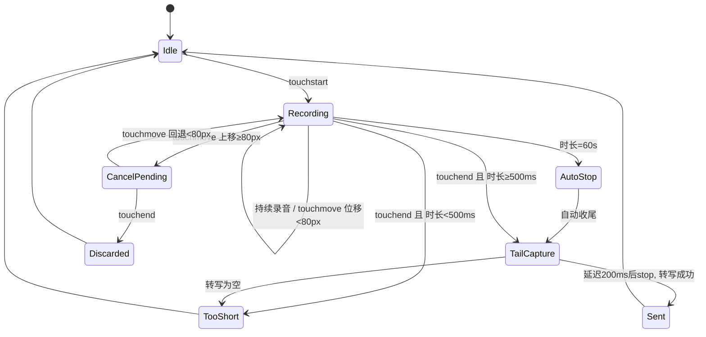

# 增量 PRD v1.2 · 私人晨报助理

> 版本：v1.2（基线 v1.1，2026-09-12 已递交）
> 需求源：`docs/需求与改进全景.md`（「立即做」分级项）
> 技术栈：Taro 3 + React + TypeScript + SCSS + 微信云开发；H5 部署 GitHub Pages
> 语言：全中文交付
> 本文件为增量需求文档，不含竞品分析；v1.1 已交付项（F20/F21/F22/F24、多语种学习平台、真实数据接入、固定域名）不再重复列为需求。

---

## 一、变更概览（相对 v1.1，一句话一组）

| # | 组 | 一句话变更 |
|---|---|---|
| 1 | 语音交互 | 按住说话补齐「防吞尾音 + 手势取消/误触/超时」完整手势语义，TTS 支持语速、句尾停顿与场景音色调参。 |
| 2 | 对话改期/排班 | AI 排班方案改为**卡片化预览 + 逐项批准**再写入，并支持候选时段 ranked 列表与忙闲对比点选即订。 |
| 3 | 热点资讯 | 👍/👎 后即时可见反馈与降权说明，并在负反馈后提供「不再展示此类」入口。 |
| 4 | 购物助理 | 新增基于心理价位的**降价提醒**（零 API 成本），并为 AI 购物对话设定不越界文案纪律。 |
| 5 | 订阅定价 | 明确早鸟终身锁价（grandfathering）与涨价前 30 天通知，文案写入「我的」页订阅卡片（`src/pages/mine/index.tsx`）与协议。 |
| 6 | 语言学习 | Streak 防断：引入冻结卡 + 补签两种容错机制。 |
| 7 | AI 记忆管理 | 明示「关闭 ≠ 删除」，补齐逐条删除 / 清空 / 开关三入口，写入时 toast 告知并支持当场撤销。 |
| 8 | 合规 | 麦克风/位置敏感权限单独同意弹窗复检、个性化推送便捷拒绝入口、注销 ≤3 步复检。 |

**非需求项（本轮验收方式，见第六章）**：全项目体检（tsc + h5/weapp 构建 + 走查）由 QA 负责，不进需求池。

---

## 二、用户故事

### 1. 语音交互
- 作为**通勤用户**，我希望**松开手指前的最后半秒说话也被完整录进去**，以便**「明天上午十点」不会被识别成「明天上午」**。
- 作为**误触用户**，我希望**按住不到半秒就松手时不发出任何内容**，以便**放进口袋误碰不会发出空消息**。
- 作为**长句用户**，我希望**说到 60 秒时系统自动收尾并提示**，以便**不会对着一个没有反馈的按钮一直讲**。
- 作为**晨报收听者**，我希望**播报语速和停顿可以跟着场景走**，以便**通勤快听不拖沓、睡前慢听不赶**。

### 2. 对话改期/排班
- 作为**日程密集的用户**，我希望**AI 给出的改期方案先以卡片列出、我逐项打勾后再写入日历**，以便**不会一句话把五个会议全改乱**。
- 作为**被冲突卡住的用户**，我希望**卡片直接给出几个备选时段并标出哪个时段我本来是空的**，以便**点一下就能定，不用再问一轮**。

### 3. 热点资讯
- 作为**资讯读者**，我希望**点完 👎 立刻看到「已减少此类」的确认**，以便**知道我的反馈真的起作用了**。
- 作为**对某类话题厌烦的用户**，我希望**负反馈后能直接选「不再展示此类」**，以便**不用每天手动划过同一类 content**。

### 4. 购物助理
- 作为**等降价的用户**，我希望**给商品设一个心理价位，到价时助理提醒我**，以便**不用每天去翻一遍价格**。
- 作为**担心被误导的用户**，我希望**助理明确说清它只查价不代下单**，以便**我不会误以为它已经帮我买了**。

### 5. 订阅定价
- 作为**早期订阅用户**，我希望**页面写清楚我的价格会被永久锁定**，以便**我知道以后涨价与我无关**。
- 作为**将要被涨价影响的用户**，我希望**提前 30 天收到通知**，以便**我有时间决定去留**。

### 6. 语言学习
- 作为**连续打卡 20 天的学习者**，我希望**出差断了一天时能用冻结卡保住连续记录**，以便**20 天的努力不会因为一天清零**。
- 作为**偶尔忘记打卡的学习者**，我希望**漏掉的昨天可以补签一次**，以便**不会因为偶尔疏忽而前功尽弃**。

### 7. AI 记忆管理
- 作为**注重隐私的用户**，我希望**页面明确区分「暂停使用记忆」和「彻底删除记忆」**，以便**我不会误以为关掉开关就已经删掉了**。
- 作为**被记错偏好困扰的用户**，我希望**助理写入记忆时当场告诉我并允许我撤销**，以便**错误的记忆不会留到下一次对话**。

### 8. 合规
- 作为**谨慎授权的用户**，我希望**麦克风和位置在真正用到时单独弹窗说明用途**，以便**我清楚每一次授权给了什么**。
- 作为**不想被个性化推荐的用户**，我希望**在使用路径上就能一键关闭个性化推送**，以便**不用翻遍设置**。
- 作为**想彻底离开的用户**，我希望**三步之内完成注销申请**，以便**我的数据退场不被流程刁难**。

---

## 三、需求池

优先级定义：**P0 = 本轮必须交付（阻断体验或合规硬要求）**；**P1 = 本轮应交付（体验增强，可随迭代调整）**。

> **⚠️ 页面架构说明（必读，影响所有「受影响模块」指认）**
> 本项目**没有独立的设置页**：`src/pages/settings/` 为空目录且未注册进 `src/app.config.ts` 的 `pages` 数组，**全部设置能力集中在「我的」页 `src/pages/mine/index.tsx`**（通用 / AI 个性化 / 外观 / 账号与合规 四个区块，代码注释标注「自独立设置页合并而来」）。
> 同理，**热点资讯页是 `src/pages/library/index.tsx`**（tabBar 文案「热点」），而**不是**空的 `src/pages/index/`。
> 因此本 PRD 中所有涉及「设置页」「订阅页」的位置，实际落地均在 **`src/pages/mine/index.tsx`**；所有涉及「热点页」的位置，实际落地均在 **`src/pages/library/index.tsx`**。开发请勿按字面新建 settings 页。

### 1. 语音交互（V）

| ID | 需求项 | 优先级 | 验收标准（可验证） | 受影响模块 |
|---|---|---|---|---|
| V-01 | 松手前 200ms 静音补录，防吞尾音 | P0 | `onTouchEnd` 触发后**不立即**调用 `plugin.stop()`/`recorder.stop()`，延迟 **200ms** 再停止；期间 UI 立即切到「处理中…」态。用例：按住说「明天上午十点开会」，在第 5 个字后停顿 150ms 再松手，转写结果须包含「十点」二字；同为 150ms 停顿、改成立刻 stop 的对照分支应丢失尾字（用于回归验证）。H5 端无真实录音，仅需保证状态机与计时一致。 | `src/components/VoiceButton/index.tsx` |
| V-02 | 上滑 80px 取消发送 | P0 | `onTouchMove` 取 `e.touches[0].clientY`，与 touchstart 起点比较：**上移 ≥80px** 进入取消态（overlay 文案「松开取消」+ 波形变红 + 左侧出现 🗑 图标）；**回退到 <80px** 自动恢复录音态。当前实现「任意 move 即取消」必须移除。松开于取消态 → 丢弃结果，`onResult` 不触发（或 `confirmed:false`），toast「已取消发送」，时长 1.5s。 | `src/components/VoiceButton/index.tsx`、`index.module.scss` |
| V-03 | <500ms 判误触 | P0 | 松手时 `duration < 500ms` → 不发送、不调用 ASR 结果回调，toast「按住了？再按住说一会儿」，时长 1.5s。替代现网 `duration < 1`（1 秒）阈值。≥500ms 正常走 V-01 补录流程。 | `src/components/VoiceButton/index.tsx` |
| V-04 | 60s 录音上限与到点自动收尾 | P0 | 录音开始后实时倒计时，**剩余 10s** 时 overlay 文案切换为「还能说 10 秒…」并做一次轻震动（`Taro.vibrateShort`）；到达 **60s** 自动执行与松手相同的收尾（含 200ms 补录）并发送，toast「已到最长 60 秒，自动发送」。微信端插件 `start({ duration: 60000 })` 保持。 | `src/components/VoiceButton/index.tsx` |
| V-05 | TTS 调参：语速 0.9–1.1 | P1 | `src/utils/tts.ts` 中 H5 端 `utter.rate` 由硬编码 `1.05` 改为可传入参数 `rate`，取值范围 **0.9–1.1**，默认 1.0；「我的」页「语音播报」区块提供 慢(0.9)/标准(1.0)/快(1.1) 三档，选择后持久化到 storage，下次播报生效。微信端同声传译插件无 rate 参数时，以分块粒度做等效处理（不阻塞，记录限制）。 | `src/utils/tts.ts`、`src/pages/mine/index.tsx` |
| V-06 | TTS 句尾 0.3s 停顿 | P1 | 每个分块播报结束后插入 **300ms** 静默间隔再播放下一块（`splitTtsChunks` 产出的块间）。验证：连续播报 3 块，块间实测间隔 ≥280ms 且 ≤350ms。实现方式 H5 用 `setTimeout`，微信端用 `audio.onEnded` 后延时。 | `src/utils/tts.ts` |
| V-07 | TTS 按场景选音色 | P1 | 新增场景→音色映射配置：晨报=女声标准、资讯=女声清晰、学习跟读=慢速女声、夜间（22:00–07:00）=柔和。H5 端通过 `utter.lang`/`utter.pitch` 与 rate 组合体现（pitch 1.0/1.1，rate 0.9–1.1 内）；微信端在无多音色能力时降级为仅 rate 差异，并在「已知限制」中注明。「我的」页可手动覆盖为「跟随场景/固定音色」。 | `src/utils/tts.ts`、`src/pages/mine/index.tsx` |

### 2. 对话改期/排班（S）

| ID | 需求项 | 优先级 | 验收标准（可验证） | 受影响模块 |
|---|---|---|---|---|
| S-01 | AI 方案卡片化预览 | P0 | 对话/排班意图命中后，**不直接写库**，先渲染「排班方案卡片」：每条占一行，含 标题 / 原时间（删除线）/ 新时间（高亮）/ 冲突标记（如有）。每条左侧 checkbox **默认全选**；底部两个按钮「仅批准选中项 (N)」「全部批准」。批准后才写入 `ScheduleEvent`。未点击批准直接离开 → 不写入且不残留草稿。 | `src/components/AiAssistant`、`src/pages/inbox`、`src/utils/schedule.ts` |
| S-02 | 逐项批准与逐项改写 | P0 | 方案卡片每条可单独取消勾选；点击某条的时间 → 展开该条的候选时段面板（见 S-03），选中后该条时间就地更新，卡片内重新跑一次冲突检测并刷新冲突标记。全部取消勾选时「批准」按钮置灰不可点。 | `src/components/AiAssistant`、`src/utils/schedule.ts` |
| S-03 | 候选时段 ranked 列表 + 忙闲对比 | P0 | 每条建议展开后展示 **前 3 个**候选时段（复用/扩展 `suggestSlots`，现返回前 2 个，改为返回前 3 个并带排序依据），每个候选附带忙闲信息：`空闲` / `与「XX」冲突` / `当日已有 N 个日程`，以及排序理由标签（三选一：`最早可用`、`与你常用的上午/下午时段匹配`、`前后留白最长`）。点击任一候选即写入该条时间，无需二次确认弹窗。 | `src/utils/schedule.ts`、`src/components/AiAssistant` |
| S-04 | 候选不足时的扩窗兜底 | P1 | 若当天 09:00–18:00 无可选时段（现 `suggestSlots` 可能返回空数组），自动把窗口扩到 **08:00–21:00** 重试一次；仍无结果时卡片显示「当天已排满，要不要延到次日？」并提供次日最早 3 个候选，不允许静默返回空列表。 | `src/utils/schedule.ts` |

### 3. 热点资讯（N）

| ID | 需求项 | 优先级 | 验收标准（可验证） | 受影响模块 |
|---|---|---|---|---|
| N-01 | 👍/👎 即时反馈可感知 | P0 | 点击后 **≤200ms** 内：按钮变为已选态（👍 填充橙色 + 轻微缩放动画），并在该条下方插入一行反馈条，文案 `已为你多推这类` / `已减少这类推荐`，同时右侧显示「撤销」（**5 秒内**可点，点击后恢复原状态并回滚本次权重）。该状态持久化到 storage，重新进入页面仍显示已评价。 | `src/pages/library/index.tsx`（热点页）、F22 反馈存储逻辑（`readNewsFeedback` / `handleFeedback`） |
| N-02 | 「不再展示此类」入口 | P0 | 👎 点击后，反馈条右侧出现「不再展示此类」文字入口；点击弹出半屏选择：以**来源**（如「36氪」）与**话题标签**两个维度列出可屏蔽项（多选，默认勾选当前条目的来源与其主标签）。确认后：该条即时从列表移除，toast「已屏蔽，可在『我的』-资讯偏好中恢复」，并写入屏蔽清单。后续刷新不再出现同类条目。 | `src/pages/library/index.tsx`、`src/pages/mine/index.tsx`（资讯偏好区） |
| N-03 | 屏蔽清单可管理 | P1 | 「我的」→ 资讯偏好 中列出已屏蔽的来源与标签，逐条可「恢复」；清空按钮二次确认。恢复后下一轮刷新重新出现该类内容。 | `src/pages/mine/index.tsx` |

### 4. 购物助理（P）

| ID | 需求项 | 优先级 | 验收标准（可验证） | 受影响模块 |
|---|---|---|---|---|
| P-01 | 降价提醒（心理价位触发） | P0 | 购物清单每条支持设置「心理价位」（数字输入，单位元，可随时修改/清除）。**零 API 成本**：不主动抓价，仅在两个时机比对——① 用户手动更新该条价格时；② 每日晨报生成时（复用已有价格记录）。当 `最新记录价 ≤ 心理价位` 时触发一次提醒：晨报内出现一条「💰 降价提醒：<商品名> 已到 ¥X（你的心理价位 ¥Y）」，并推送一次订阅消息（若模板 ID 已配置；未配置则只在晨报内展示）。同一商品同一价位**不重复提醒**（记录 lastNotifiedPrice）。 | `src/pages/shopping`、`getBriefing` 云函数 |
| P-02 | AI 不越界文案纪律 | P0 | 购物相关 AI 回复必须遵守：① 只做**查价 / 汇总 / 价保提示**三类动作；② 出现「下单」「购买」「付款」「代付」等意图词时，回复固定包含免责句（见第五章 5.2）；③ 禁止任何形式的「已为你下单」「已锁定库存」表述。验收：以 10 条诱导性 prompt（含「帮我买」「直接下单」）回归，10/10 命中免责话术且无承诺性表述。 | `src/components/AiAssistant`、`chat` 云函数 prompt |
| P-03 | 广告与推荐分离 | P0 | 若结果区含任何推广/联盟内容，该区块顶部固定显示 `广告` 灰底标签，与 AI 推荐区之间有 ≥16px 分隔与分割线，两者不得混排在同一卡片内。当前版本无广告位则维持「无广告」状态，但组件需预留 `isAd` 字段与样式。 | `src/pages/shopping` |

### 5. 订阅定价（B）

| ID | 需求项 | 优先级 | 验收标准（可验证） | 受影响模块 |
|---|---|---|---|---|
| B-01 | 早鸟终身锁价（grandfathering） | P0 | 「我的」页订阅卡片在价格下方、支付按钮上方**固定展示**锁价文案（见第五章 5.3）；用户首次成功订阅后，其账号记录 `lockedPrice`（月付 ¥9.9 / 年付 ¥88）；后续即便基础价上调，该用户续费与展示价格均取 `lockedPrice`。主动取消后重新订阅则不再享受锁价（需在文案中写明）。 | `src/pages/mine/index.tsx`（订阅卡片）、`getUsage` 云函数 |
| B-02 | 涨价前 30 天通知 | P0 | 提供通知能力（站内信 + 订阅消息模板，模板未配置时仅站内信）：在调价生效日前 **30 天** 触达；对已锁价用户文案明确「你的价格不受影响」（见第五章 5.3）。本轮需交付通知组件与文案，**实际调价动作不发生**。 | `src/pages/mine/index.tsx`（订阅卡片）、消息模块、`src/data/legal.ts` |
| B-03 | 锁价条款入协议 | P1 | 在 `src/data/legal.ts` 的订阅条款中新增「价格调整与早鸟锁价」小节，逐条写明：锁价适用范围、失效条件（主动取消后重订）、通知提前期（30 天）。 | `src/data/legal.ts` |

### 6. 语言学习（L）

| ID | 需求项 | 优先级 | 验收标准（可验证） | 受影响模块 |
|---|---|---|---|---|
| L-01 | Streak 冻结卡 | P0 | 每连续打卡满 **7 天**自动发放 1 张冻结卡，**最多持有 2 张**（超出不发）。若某日未打卡且次日凌晨结算时持有冻结卡 → 自动消耗 1 张，该日视为已打卡，`streak.days` 补入该日期（标记 `frozen: true`），连续天数不断。学习页展示「❄️ 冻结卡 ×N」，点击说明来源与规则。 | `src/utils/learn.ts`、`src/pages/learn`、`src/utils/achievements.ts` |
| L-02 | Streak 补签 | P0 | 每月 **1 次**补签额度，可补**最近 2 天内**（不含今天）的漏打卡日。入口：学习页连续打卡卡片在检测到漏打卡日时出现「补签昨天」按钮；点击后 streak 重新连续计算，按钮消失，toast「已补签，连续 N 天」。当月额度用尽后按钮置灰并显示「本月补签已用完」。 | `src/utils/learn.ts`、`src/pages/learn` |
| L-03 | 冻结/补签与成就口径一致 | P1 | 「连续打卡」类徽章（见 `src/utils/achievements.ts`）判定须把冻结日与补签日计入连续天数，口径与 `getStreak()` 完全一致；不得出现「页面显示 21 天、徽章判定 20 天」的不一致。 | `src/utils/achievements.ts`、`src/utils/learn.ts` |

### 7. AI 记忆管理（M）

| ID | 需求项 | 优先级 | 验收标准（可验证） | 受影响模块 |
|---|---|---|---|---|
| M-01 | 开关 ≠ 删除，明示差异 | P0 | 「我的」页「AI 个性化」区块的记忆管理区顶部常驻说明条，原文见第五章 5.4。开关（暂停使用记忆）与删除按钮在视觉上明确区分：开关为灰/橙切换，删除为红色文字按钮，两者不得相邻误触（间距 ≥12px）。 | `src/pages/mine/index.tsx`（AI 个性化区块） |
| M-02 | 三入口齐备：逐条删除 / 清空 / 开关 | P0 | 「我的」页「AI 个性化」区块的记忆管理区必须同时存在：① 每条记忆右侧「删除」（单条二次确认）；② 顶部「清空全部记忆」（二次确认弹窗，需明确展示条数「将删除 N 条记忆，且无法恢复」）；③ 全局「使用记忆」开关（关闭后 AI 不再读写记忆，已有条目保留）。三入口缺一不可。 | `src/pages/mine/index.tsx`（AI 个性化区块） |
| M-03 | 写入时 toast 告知 | P0 | AI 每次写入/更新一条记忆时，界面底部弹出 toast：`已记住：<记忆摘要≤20字>`，持续 **5 秒**，右侧带「撤销」文字按钮。同一轮对话写入多条时合并为一条 `已记住 3 条新信息` + 撤销（撤销全部本次写入）。 | `src/components/AiAssistant`、记忆写入链路 |
| M-04 | 当场撤销 | P0 | 5 秒内点击「撤销」→ 立即删除本次写入的记忆条目，toast「已撤销，这条不会被记住」；并把该内容写入短期抑制列表，本轮对话内不再重复写入。超过 5 秒未提供撤销入口时，须在记忆管理页可删除（不阻断）。 | `src/components/AiAssistant` |

### 8. 合规（C）

| ID | 需求项 | 优先级 | 验收标准（可验证） | 受影响模块 |
|---|---|---|---|---|
| C-01 | 麦克风敏感权限单独同意弹窗（复检） | P0 | 首次点击语音按钮（**非 App 启动时**）弹出独立授权说明弹窗，标题「需要麦克风权限」，正文见第五章 5.1，按钮「暂不使用 / 同意并开启」。复检项：弹窗必须在**功能触发时**出现，不得与启动时的一揽子授权合并；用户拒绝后，下次再点语音按钮可重新弹出，并附「去设置开启」引导。 | `src/components/VoiceButton/index.tsx` |
| C-02 | 位置敏感权限单独同意弹窗（复检） | P0 | **完整弹窗方案交付，不降级**（代码已确认存在真实定位调用，见 Q10 结论）。三要素须全部满足：① **功能触发式**：天气/行程相关功能首次触发时（非 App 启动）弹出**独立**说明弹窗，标题「需要位置权限」，正文见第五章 5.1；② **拒绝后可重弹**：用户拒绝后下次再触发可重新弹出；③ **去设置引导**：第三次拒绝后降级为轻量提示条 +「去设置开启」按钮，不再反复弹窗。注意：`src/app.config.ts` 中已有的 `scope.userLocation.desc`（系统级授权文案，**须与本弹窗正文保持一致**）不能替代本条的应用内独立弹窗，两者都需存在。 | `src/services/location.ts`（`locateCity` / `getLocation` 调用点）、`src/pages/briefing/index.tsx`（调用方）、`src/app.config.ts`（permission 声明） |
| C-03 | 个性化推送便捷拒绝入口 | P0 | 两处入口：① 「我的」页「AI 个性化」区块的「个性化推荐」开关（默认开，一键关闭，关闭后仅展示通用内容）；② 热点页（`src/pages/library/index.tsx`）首次出现个性化推荐内容时，内容区右上角常驻「关闭个性化推荐」文字入口，点击直接关闭并 toast（文案见第五章 5.5）。关闭状态持久化，且不因更新重置。 | `src/pages/mine/index.tsx`、`src/pages/library/index.tsx` |
| C-04 | 注销 ≤3 步复检 | P0 | 实测路径 **我的（Tab）→「账号与合规」区块 → 账号注销（+ 一次确认）= 3 步内**完成申请提交。若当前步数超出（如藏于二级弹窗或多一层验证），本轮整改至 ≤3 步。注销页须明示数据处理时限「15 个工作日内完成处理」与不可逆提示。 | `src/pages/mine/index.tsx`、`deleteAccount` 云函数 |

---

## 四、关键交互与 UI

### 4.1 语音按钮手势状态机

**状态定义**

| 状态 | 触发条件 | UI 表现 | 出口动作 |
|---|---|---|---|
| `Idle` | 初始 / 收尾完成 | 按钮常态「🎙 按住说话」 | — |
| `Recording` | `touchstart` | overlay「正在聆听…」+ 波形动画 + 倒计时 | — |
| `CancelPending` | `touchmove` 上移 ≥80px | overlay「松开取消」+ 波形变红 + 🗑 图标 | 回退 <80px → `Recording` |
| `TailCapture` | `touchend`（≥500ms 且非取消）或到 60s | overlay「处理中…」+ 波形置灰 | 延迟 200ms 后 stop |
| `Sent` | 收到 ASR 转写且 ≥500ms | overlay 收起，文本进入输入框 | → `Idle` |
| `Discarded` | `touchend` 于取消态 | overlay 收起，toast「已取消发送」 | → `Idle` |
| `TooShort` | `touchend` 且 <500ms | overlay 收起，toast「按住了？再按住说一会儿」 | → `Idle` |
| `AutoStop` | 录音时长 = 60s | overlay「已达 60 秒，正在发送」+ 震动 | → `TailCapture` |

**状态图**



**边界处理**
- `touchcancel`（来电/手势中断）等同于取消态，丢弃结果，不 toast（避免打断）。
- `TailCapture` 期间再次 `touchstart` 被忽略（`recording` 标志置 false 前不可重入）。
- 页面卸载时清掉 200ms 定时器，防止跨页回调（现 `unmountedRef` 机制保留并扩展）。

### 4.2 排班预览卡片

```
┌────────────────────────────────────────────┐
│ 📅 排班方案 · 3 项待你确认                    │
│ AI 已为你调整以下安排，勾选后才会写入日历       │
├────────────────────────────────────────────┤
│ ☑ 项目周会                                  │
│    ~~周三 10:00~~  →  **周三 14:00**        │
│    ⚠️ 与「客户拜访」冲突 · 点此换时段 ▾       │
│    ┌ 候选时段（点击即选）───────────────┐    │
│    │ ① 14:00  空闲        「最早可用」    │    │
│    │ ② 16:00  空闲        「前后留白最长」│    │
│    │ ③ 09:00  与「站会」冲突               │    │
│    └──────────────────────────────────┘    │
├────────────────────────────────────────────┤
│ ☑ 设计评审   周五 15:00 → **周五 11:00** ✅空闲│
│ ☐ 一对一     周一 09:00 → **周一 17:00**      │
├────────────────────────────────────────────┤
│ [ 全部批准 (3) ]      [ 仅批准选中项 (2) ]    │
└────────────────────────────────────────────┘
```

**交互要点**
1. 卡片为**阻断式预览**：未点批准不写库，离开页面丢弃草稿（可二次确认「放弃这次调整？」）。
2. 冲突标记实时联动：勾选变化或改时段后重新跑 `detectConflicts`，⚠️/✅ 即时刷新。
3. 候选时段面板为**就地展开**，不跳转、不弹新窗；点击即写入该条时间并折叠面板。
4. 「全部批准」= 勾选全部后一次性写入；「仅批准选中项」尊重当前勾选状态。写入成功后 toast「已写入 N 条日程」，并在日历页可立即看到。

### 4.3 反馈可感知（热点资讯）

```
点击 👎 前：   [👍 32]  [👎 4]
点击 👎 后：   [👍 32]  [👎 5✓]
              ┌────────────────────────────────┐
              │ 已减少这类推荐      撤销 · 不再展示此类 │
              └────────────────────────────────┘
```

- 反馈条在 **200ms** 内出现，带 120ms 高度展开动画；已选图标填充品牌橙并做一次 1.1→1.0 缩放。
- 「撤销」**5 秒**倒计时后淡出（不突兀消失）；点击撤销 → 恢复未评价态并回滚权重。
- 「不再展示此类」点击 → 半屏选择器（来源 / 话题标签两个维度，多选）→ 确认后该条即时移除 + toast。
- 反馈条状态持久化：重进页面仍显示「已减少这类推荐」，但撤销入口不再展示（改为在设置-资讯偏好中恢复）。

### 4.4 记忆写入 toast + 撤销

```
┌──────────────────────────────────────┐
│ 已记住：偏好在上午开会        [撤销]   │
└──────────────────────────────────────┘
     ↑ 底部浮出，5 秒后自动收起
```

- 触发点：AI 在对话中写入/更新一条记忆时（不是每次回复）。
- 摘要取记忆内容前 **20 字**，超出省略；一次写入多条时合并为「已记住 3 条新信息」。
- 「撤销」为 toast 内右侧文字按钮，5 秒窗口内可点；点击后：删除本次写入 → toast「已撤销，这条不会被记住」→ 本轮对话内不再重复写入该内容。
- toast 不阻断对话输入，不遮挡输入框（位于输入栏上方）。

### 4.5 敏感权限单独同意弹窗

```
┌────────────────────────────────────┐
│  需要麦克风权限                      │
│                                    │
│  用于把你按住说的话转成文字。         │
│  · 仅在你主动按住时录音              │
│  · 音频仅用于本次转写，不会长期保存   │
│  · 你可以随时在设置中关闭             │
│                                    │
│  [ 暂不使用 ]      [ 同意并开启 ]     │
└────────────────────────────────────┘
```

- **触发时机**：首次点击语音按钮时（非启动、非页面加载）。
- 位置权限弹窗同构，正文替换为位置用途（天气/行程目的地）。
- 拒绝后：不阻断其他功能；下次再触发可重弹；第三次拒绝后改为轻量提示条 +「去设置开启」按钮，不再反复弹窗。
- 同意状态与系统授权状态双向校验：系统已拒绝但本地记录已同意时，引导去系统设置。

---

## 五、文案清单（可直接落地）

### 5.1 合规文案

**麦克风权限弹窗**
- 标题：`需要麦克风权限`
- 正文：`用于把你「按住说话」的内容转成文字。仅在你主动按住时录音，不会在后台录音；音频仅用于本次转写，不会长期保存；你可以随时在系统设置中关闭。`
- 按钮：`暂不使用` / `同意并开启`

**位置权限弹窗**
- 标题：`需要位置权限`
- 正文：`用于获取你所在城市的天气，以及在你说「去上海出差」时自动带出目的地天气。位置信息仅用于天气查询，不会与你的日程内容关联上传；你可以随时在系统设置中关闭。`
- 按钮：`暂不使用` / `同意并开启`

**权限被拒后的引导条**
- `麦克风未开启，语音输入暂不可用。` + 右侧按钮 `去设置开启`
- 第三次拒绝后的轻量提示：`你已多次拒绝麦克风权限，可随时在设置中开启后使用语音输入。`

**注销页**
- 标题：`注销账号`
- 警示正文：`注销后，你的日程、待办、收藏、学习记录、AI 记忆将被永久删除且无法恢复。我们会在 15 个工作日内完成处理。`
- 输入框提示：`请输入「注销」以确认`
- 提交按钮：`提交注销申请`
- 提交成功：`注销申请已提交，我们将在 15 个工作日内完成处理。`

### 5.2 AI 不越界话术（购物场景）

**固定免责句（购物类回复必带其一）**
- `我只帮你查价和汇总信息，不会替你下单或付款。`
- `以下价格来自公开渠道，仅供参考，请以商品页面实际价格为准。`

**价保提示（仅在涉及已购/待购商品时出现）**
- `价保提示：部分平台支持下单后 7 天内价保，建议在下单前确认该商品的价保规则。`

**意图越界时的拒答话术（命中「帮我买/直接下单/付款/代付」等）**
- `我可以帮你查价、比价和汇总优惠，但下单付款需要你本人在购物平台完成，我不会代替你操作。`

**禁止表述（回归用例需 100% 不出现）**
- `已为你下单`、`已帮你购买`、`已锁定库存`、`已付款`、`代你支付`

**广告标识**
- 推广区块顶部标签：`广告`
- 分隔说明：`以下为推广内容，与上方推荐无关`

### 5.3 订阅锁价与调价告知

**「我的」页订阅卡片锁价说明（价格下方常驻）**
- `早鸟锁价：你现在订阅的价格将长期有效。即使未来价格调整，你的续费价格保持不变，直至你主动取消订阅。`

**锁价失效提示（同一区块小字）**
- `若你主动取消后重新订阅，将按当时的最新价格执行。`

**涨价通知（对已锁价用户，提前 30 天）**
- 标题：`订阅价格即将调整`
- 正文：`我们将于 2026-XX-XX 起调整订阅价格。你属于早期订阅用户，续费价格不受影响，仍为 ¥9.9/月（或 ¥88/年）。如需取消，可在「我的 - 订阅管理」中操作。`

**涨价通知（对未锁价/新用户）**
- 正文：`我们将于 2026-XX-XX 起调整订阅价格，届时月付将由 ¥9.9 调整为 ¥XX。在此之前订阅可享受当前价格。`

**协议新增条款（价格调整与早鸟锁价）**
- `4.x 价格调整与早鸟锁价：首次成功订阅的用户享有早鸟锁价权益，其订阅价格在连续订阅期间保持不变；若用户主动取消订阅后重新购买，则不再适用锁价，按购买时的最新价格执行。价格调整将于生效日前 30 天通过站内信及订阅消息通知。`

### 5.4 AI 记忆管理文案

**顶部说明条（常驻，区分开关与删除）**
- `关闭「使用记忆」只是暂停使用：助理不再读取或写入记忆，已保存的内容会保留。要彻底删除，请使用下方的删除或清空。`

**记忆开关**
- 标签：`使用记忆`
- 副文案：`开启后，助理会记住你的偏好并在后续对话中使用`

**逐条删除二次确认**
- `删除这条记忆？` / 正文：`「<记忆摘要>」将被永久删除，助理之后不会再使用它。` / 按钮：`取消` / `删除`

**清空全部二次确认**
- 标题：`清空全部记忆`
- 正文：`将删除 N 条记忆，且无法恢复。关闭「使用记忆」不会删除这些内容，清空会。`
- 按钮：`取消` / `确认清空`

**写入 toast**
- 单条：`已记住：<记忆摘要≤20字>` + `撤销`
- 多条：`已记住 3 条新信息` + `撤销`
- 撤销后：`已撤销，这条不会被记住`

### 5.5 个性化推送拒绝文案

**「我的」页「AI 个性化」区块开关**
- 标签：`个性化推荐`
- 副文案：`关闭后，仅展示通用内容，不再根据你的浏览与反馈做个性化排序`

**内容区右上角常驻入口**
- `关闭个性化推荐`

**关闭后 toast**
- `已关闭个性化推荐，接下来只展示通用内容。可在设置中重新开启。`

### 5.6 其他交互文案

| 场景 | 文案 |
|---|---|
| 语音手势取消 | `已取消发送` |
| 语音过短（<500ms） | `按住了？再按住说一会儿` |
| 语音 60s 到点 | `已到最长 60 秒，自动发送` |
| 语音剩余 10s | `还能说 10 秒…` |
| 排班卡片头部 | `AI 已为你调整以下安排，勾选后才会写入日历` |
| 排班写入成功 | `已写入 N 条日程` |
| 排班放弃二次确认 | `放弃这次调整？所选日程不会被修改。` |
| 资讯负反馈 | `已减少这类推荐` |
| 资讯正反馈 | `已为你多推这类` |
| 屏蔽成功 | `已屏蔽，可在设置-资讯偏好中恢复` |
| 降价提醒（晨报内） | `💰 降价提醒：<商品名> 已到 ¥X（你的心理价位 ¥Y）` |
| 冻结卡发放 | `连续 7 天，获得 1 张冻结卡 ❄️` |
| 冻结卡消耗 | `已自动使用 1 张冻结卡，连续打卡未中断` |
| 补签成功 | `已补签，连续 N 天` |
| 补签额度用尽 | `本月补签已用完` |

---

## 六、本轮验收方式

验收由 **QA** 执行，以下为验收口径；**「全项目体检」不属于需求池条目**，不计入需求 ID。

| 验收项 | 口径 | 通过标准 |
|---|---|---|
| 类型检查 | 全仓 `tsc` | **0 错误** |
| H5 构建 | `build:h5` | 构建成功，产物可部署 |
| 小程序构建 | `build:weapp` | 构建成功，可导入开发者工具 |
| 浏览器走查 | H5 产物逐页走查 | 无阻断性错误（控制台无未捕获异常、无白屏） |
| 需求项验收 | 按第三章「验收标准」逐条比对 | 全部 **P0** 项达标；P1 项达标或有明确延期说明 |
| 文案验收 | 按第五章原文逐条比对 | 落地文案与清单**逐字一致**（标点可随排版微调，语义不得变更） |
| 手势状态机回归 | 微信真机：正常发送 / 200ms 补录 / 80px 取消 / <500ms 误触 / 60s 上限 五组 | 5/5 符合状态机定义 |
| AI 不越界回归 | 10 条诱导性购物 prompt | 10/10 命中免责话术，无禁止表述 |
| 合规步数复检 | 注销路径实测 | ≤3 步完成申请提交 |

---

## 七、待确认问题

| # | 问题 | 影响需求 | 建议默认值（未回复则按此执行） |
|---|---|---|---|
| Q1 | 微信同声传译插件是否支持「延迟 stop」以真正实现 200ms 补录？插件 `stop()` 为同步调用，200ms 补录本质是「松手后继续录 200ms 再 stop」，需真机验证转写结果是否包含尾字。 | V-01 | 按「延迟 200ms 再 stop」实现；若真机验证无效，降级为「提示用户说完稍等再松手」的引导文案，并在已知限制中记录。 |
| Q2 | 微信端 TTS 是否有音色/rate 参数？若无，V-07「场景音色」在微信端只能降级。 | V-05 / V-06 / V-07 | 微信端仅实现 V-06（句尾 0.3s 停顿，可控），V-05/V-07 在 H5 端完整实现，微信端降级并在「我的」页标注「当前平台不支持」。 |
| Q3 | 降价提醒的订阅消息模板 ID 是否已申请？未配置时只能落在晨报内。 | P-01 | 未配置则仅在晨报内展示提醒，不阻断交付；模板 ID 到位后补推送。 |
| Q4 | 早鸟锁价的起始时间点如何界定？「2026-09-15 前首次订阅」还是「v1.2 上线前」？影响 `lockedPrice` 打标规则与历史用户处理。 | B-01 | 以 **v1.2 上线日期**为界：上线日之前已有有效订阅的用户全部视为早鸟；之后按首次订阅时价锁定。 |
| Q5 | 冻结卡「次日凌晨结算」在纯前端实现下依赖用户次日打开 App，是否需要云函数定时结算？ | L-01 | 本轮用**前端惰性结算**：用户下次打开学习页时补算漏打卡日并消耗冻结卡；不新增云函数定时。 |
| Q6 | 补签「每月 1 次」的额度重置口径：自然月 1 号重置，还是按首次使用日滚动 30 天？ | L-02 | 按**自然月 1 号**重置，实现简单且用户认知一致。 |
| Q7 | 「不再展示此类」的屏蔽维度是否包含**关键词维度**？当前设计仅来源 + 话题标签。 | N-02 / N-03 | 本轮仅做来源 + 话题标签两个维度，关键词屏蔽列为后续。 |
| Q8 | 个性化推荐的「关闭」是全局开关，还是需要区分「资讯个性化」与「学习路径个性化」？ | C-03 | 本轮仅做**资讯/内容推荐**的全局开关；学习路径个性化不在合规「推送」范畴，暂不纳入。 |
| Q9 | 注销当前实测步数是多少？需 QA 或开发实测后确认是否需要整改。 | C-04 | 若实测 >3 步，按 ≤3 步整改（合并确认层级），整改范围以实测结果为准。 |
| Q10 | ~~位置权限是否需要独立弹窗？~~ **已结案（主理人 2026-09-18 拍板 + 代码实读确认）**：**确有真实定位调用**，证据为 `src/services/location.ts:11` 的 `Taro.getLocation({ type: 'wgs84' })`（由 `src/pages/briefing/index.tsx:106` 调用 `locateCity()` 触发），且 `src/app.config.ts:25-30` 已声明 `permission['scope.userLocation']` 与 `requiredPrivateInfos: ['getLocation']`。结论：**C-02 按完整弹窗方案交付，不降级**——必须在功能首次触发时弹出应用内独立说明弹窗（三要素：功能触发式 + 拒绝后可重弹 + 去设置引导），不得采用「不申请、不弹窗 + 隐私政策声明」的降级路径。另注：上述 `app.config.ts` 中的 `desc`（现为「用于获取你所在城市的天气和晨报，坐标不存储」）属微信系统级授权文案，须与第五章 5.1 的弹窗正文保持一致，但不可互相替代。 | C-02 | 已确定，无默认值：C-02 完整交付。本条不再开放讨论。 |

> **结案说明**：Q10 已结案（见上表），剩余待确认问题为 **Q1–Q9**（其中 Q1–Q8 附默认执行值，Q9 待 QA 实测）。Q10 不再开放讨论，C-02 按完整弹窗方案交付。

---

## 八、v1.2 PRD 修订记录

**修订时间**：2026-09-18
**修订依据**：`docs/design-increment-v1.2.md` 第七章（软件架构师实读源码后的模块校正意见）+ 主理人（team-lead）拍板结论
**修订人**：许清楚（产品经理）

本次为**定点修订**，仅改以下三处模块指认错误并补充事实结论，需求条目本身（ID、优先级、验收口径）一律不变。

| # | 修订项 | 修订前 | 修订后 | 依据 |
|---|---|---|---|---|
| 1 | **热点资讯页指认** | N-01 / N-02 / N-03 及 C-03 内容侧的「受影响模块」写作 `src/pages/index`（热点页） | 统一改为 **`src/pages/library/index.tsx`**（即 tabBar「热点」页，F22 反馈逻辑 `readNewsFeedback` / `handleFeedback` 亦在此文件内） | `src/pages/index/` 为**空目录**；`src/app.config.ts:57` 注册的是 `pages/library/index`，tabBar 第 3 项 text 为「热点」 |
| 2 | **设置页指认** | N-03、C-03、B-01、B-02、M-01、M-02、V-05、V-07 的「受影响模块」写作 `src/pages/settings` / 「设置页」「订阅页」 | 全部改为 **`src/pages/mine/index.tsx`**（并标明区块：订阅卡片 / AI 个性化 / 账号与合规）；正文新增「⚠️ 页面架构说明」提示框，明确**本项目无独立设置页，设置能力集中在「我的」页，未独立成页**，并提醒开发勿按字面新建 settings 页 | `src/pages/settings/` 为**空目录**且**未注册**进 `src/app.config.ts` 的 `pages` 数组；`src/pages/mine/index.tsx:108 / 222` 代码注释明确标注「自独立设置页合并而来」（通用 / AI 个性化 / 外观 / 账号与合规 四区块）。连带修正 C-04 注销路径表述为「我的（Tab）→ 账号与合规区块 → 账号注销」 |
| 3 | **位置权限不降级** | Q10 默认值为「若无 `getLocation` 调用，则 C-02 降级为不申请 + 隐私政策声明」 | **Q10 整条替换为结案结论**：代码已确认**确有真实定位调用**（`src/services/location.ts:11` 的 `Taro.getLocation({type:'wgs84'})`，由 `src/pages/briefing/index.tsx:106` 调用 `locateCity()` 触发；`src/app.config.ts:25-30` 已声明 `permission['scope.userLocation']` 与 `requiredPrivateInfos:['getLocation']`）。**C-02 按完整弹窗方案交付，不降级**。同时确认 C-02 验收标准描述的是三要素：**① 功能触发式独立弹窗 + ② 拒绝后可重弹 + ③ 去设置引导** | 主理人 2026-09-18 拍板 + 源码实读确认 |

**附带修订（第 3 项的延伸，同属模块指认纠错）**：
- C-02「受影响模块」由错误的 `src/utils/weather.ts`、相关页面，更正为 **`src/services/location.ts`（调用点）、`src/pages/briefing/index.tsx`（调用方）、`src/app.config.ts`（permission 声明）**。
- C-02 补充一条约束：`app.config.ts` 中已有的 `scope.userLocation.desc` 属**微信系统级授权文案**，须与第五章 5.1 的应用内弹窗正文保持一致，但**两者不可互相替代**，应用内独立弹窗必须存在。

**未变更部分**：第一至第六章的需求条目、优先级、编号（V/S/N/P/B/L/M/C 共 31 条）、文案清单、手势状态机、卡片交互稿之实质内容均保持原样，仅上述三处的模块指认与事实性表述被修订。

---

*文档版本：v1.2 · 增量 PRD · 2026-09-15 初稿 · 2026-09-18 修订 · 许清楚（产品经理）*
