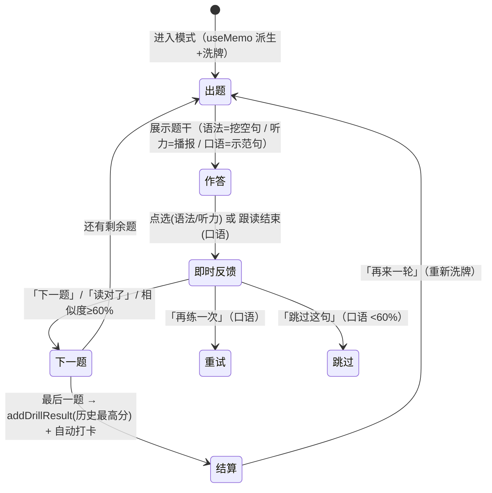

# 增量 PRD v1.3 · 私人晨报助理

> 版本：v1.3（基线 v1.2，2026-09-15 已递交）
> 需求源：v1.3 四方向优化决议（①学习平台三模块 ②代码质量 ③UI/UX ④性能）+ `docs/review-outofscope-2026-09-22.md`（计划外评审遗留缺口）
> 技术栈：Taro 4.1.9 + React 18 + TypeScript + SCSS；H5（GitHub Pages）+ 微信小程序双端
> 语言：全中文交付
> 本文件为增量需求文档；v1.2 已交付项（31 条 PRD）不再重复列为需求。
> **状态标注说明**：因本轮开发与 PRD 同步推进，需求池增加「状态」列——✅ 已落地（代码完成）/ 🔧 待修（已有实现但有缺陷）/ ⏳ 待做（未开工）。

---

## 一、变更概览（相对 v1.2，一句话一组）

| # | 方向 | 一句话变更 |
|---|---|---|
| 1 | 语言学习 | 课程学习页升级为**四模式 Tab**（单词卡 / 语法填空 / 听力选义 / 口语跟读），练习题全部从课程词库自动派生（零新增数据），练习成绩计入历史最高分并自动打卡。 |
| 2 | 语言学习 | 口语跟读引入**ASR 转写相似度自动评分**（英语课，Dice 系数），非英语课与无转写端降级为自评。 |
| 3 | 语言学习 | 多语种 TTS 扩展（中/英/日/韩），weapp 端日韩不支持发音时**前置降级提示**（听力页）与**隐藏示范保留自评**（口语页）。 |
| 4 | 合规 | 音频播报补齐 AI 生成内容**显式标识**（前导声明）与**隐式标识**（元数据/文件名/本地审计），默认晨报/资讯/夜间开启、学习场景关闭。 |
| 5 | 代码质量 | 三练习组件重复结构合并、死代码接线或清理、类型严格度收敛。 |
| 6 | UI/UX | 骨架屏、模式切换过渡动画、细节体验（触感反馈/按压态/空态）打磨。 |
| 7 | 性能 | 包体积盘点与拆分、懒加载确认、AI 回复流式输出、晨报当日缓存。 |

---

## 二、用户故事

### 1. 语言学习（三互动模块）
- 作为**学完单词卡的学习者**，我希望**换一种方式巩固同一课的词**，以便**不是每次都机械翻卡，填空/听音/开口都能轮着来**。
- 作为**拼写不牢的学习者**，我希望**在例句里挖空选词补全句子**，以便**在真实语境里记住这个词怎么用**。
- 作为**听力薄弱的学习者**，我希望**只听发音不看文字、从四个中文释义里挑对的**，以便**耳朵先于眼睛认识这个单词**。
- 作为**不敢开口的学习者**，我希望**听完示范按住话筒跟读，英语句能给我一个相似度分数**，以便**知道自己和示范差多远，而不是自我感觉良好**。
- 作为**通勤间隙学习的人**，我希望**每练完一轮就自动算作今日打卡**，以便**不用为了保住连续记录再多做一步**。
- 作为**微信端学日语的用户**，我希望**听力页明确告诉我「日语发音请在 H5 端体验」而不是放一个哑巴按钮**，以便**不浪费点击在注定无声的功能上**。
- 作为**反复练习的用户**，我希望**每次「再来一轮」题目顺序和干扰项都重新洗牌**，以便**背的是知识而不是选项位置**。

### 2. 代码质量
- 作为**后续接手的开发者**，我希望**三个练习页共用的进度条/结算卡/选项列表只维护一份**，以便**改一处样式不会漏改三处**。
- 作为**代码审查者**，我希望**导出的函数要么被调用要么被删除**，以便**不出现「装了接口没人接线」的半成品**（如 `langToAsr` / `sceneByHour`）。

### 3. UI/UX
- 作为**网络较慢的用户**，我希望**晨报/热点加载时看到结构骨架屏而不是白屏干等**，以便**知道内容在路上、界面没有坏**。
- 作为**频繁切换练习模式的用户**，我希望**Tab 切换有轻量过渡而不是生硬跳变**，以便**操作反馈连续不突兀**。

### 4. 性能
- 作为**每月流量有限的用户**，我希望**小程序主包不超限、H5 首屏资源尽量小**，以便**打开快、更新省**。
- 作为**经常使用 AI 对话的用户**，我希望**AI 回复逐段浮现而不是空白等 10 秒出全量**，以便**感知响应速度更快**。

---

## 三、需求池

优先级定义：**P0 = 本轮必须交付**；**P1 = 本轮应交付（可随迭代调整）**。

### 1. 语言学习三模块（L3）

> **页面架构说明**：四模式 Tab 落地在 `src/pages/learnDetail/index.tsx`（原单词记忆页扩展），三个练习组件为同目录 `GrammarDrill.tsx` / `ListeningDrill.tsx` / `SpeakingDrill.tsx`；题目派生纯函数在 `src/utils/learnDrills.ts`；成绩与打卡写入 `src/utils/learn.ts`（store 新增 `drill` 字段）。

| ID | 需求项 | 优先级 | 验收标准（可验证） | 受影响模块 | 状态 |
|---|---|---|---|---|---|
| L3-01 | 四模式 Tab 架构 | P0 | 学习详情页顶部为四 Tab（🃏 单词 / ✏️ 语法 / 🎧 听力 / 🗣 口语），默认进入「单词」；切换 Tab 时先 `stopSpeak()` 停掉上一次播报再切换；Tab 选中态使用课程语种主题色（`lang.accent`）。各模式状态互不串扰（切走再切回，进度保留或按各模式自身规则重置）。 | `src/pages/learnDetail/index.tsx` | ✅ |
| L3-02 | 语法填空练习 | P0 | 每词一题：从例句中定位目标词挖空（`____`），四个选项 = 正确词 + 3 个同课干扰项（已洗牌）。① 点选即判：选项锁定不可改，正确项高亮主题色、错选项标红；② 答后展示释义与整句中文翻译；③ 逐题推进，进度条按题号比例填充；④ 完成后结算：答对数、得分百分比、本课历史最高分；⑤ 「再来一轮」重新洗牌出题。**边界**：目标词在例句中定位不到、或同课干扰项不足 3 个的词跳过不出题；可出题数 **< 3** 时显示空态提示而非 0/0 结算卡。 | `GrammarDrill.tsx`、`learnDrills.ts#buildGrammarQuestions` | ✅ |
| L3-03 | 听力选义练习 | P0 | 每词一题：TTS 播报目标语单词（**不显示文字**），四个中文释义选项四选一。① 播报按钮（🔊 正常语速 0.9）+ 慢速按钮（🐢 0.6，显式 rate 原样透传不被 clamp）；② 答对/答错即时着色，答后展示单词文字 + 例句 + 中文翻译；③ 播报中点选或切题时停止当前播报；④ 结算与「再来一轮」同 L3-02。**双端降级**：weapp 端日语/韩语课（同声传译插件仅支持中英）整页替换为空态「当前端暂不支持该语种发音」；H5 端全语种可用。 | `ListeningDrill.tsx`、`learnDrills.ts#buildListeningQuestions`、`tts.ts#isTtsLangSupported` | ✅ |
| L3-04 | 口语跟读练习 | P0 | 每句三步：**听示范 → 按住话筒跟读 → 反馈**。① 示范按钮（🔊/🐢）仅在该端支持该语种 TTS 时显示，不支持时保留跟读但隐藏示范并提示；② 反馈双轨：**英语课**走 ASR 转写 + Dice 系数相似度评分（`speechSimilarity`，归一化忽略大小写/标点/空白），**≥60% 判通过**（「下一题」推进），<60% 显示鼓励文案与「跳过这句」出口；**非英语课 / H5 mock / 插件降级**（无可用转写）→ 自评模式（「读对了」即推进 /「再练一次」）；③ 已跟读句计数（已跟读 N/M 句），完成结算；④ 口语练习完成记满分 100。 | `SpeakingDrill.tsx`、`learnDrills.ts#speechSimilarity`、`VoiceButton` | ✅（L3-05 已修） |
| L3-05 | ASR 识别语种接线（缺陷修复） | P0 | 英语课跟读必须传 `asrLang='en_US'`（复用 `langToAsr(langId)`），确保 ASR 转写是英文；当前漏传导致中文转写 vs 英文例句比对、相似度恒近 0 的错误反馈。验收：英语课跟读正确朗读一句，相似度 ≥60%；故意读错一句，相似度明显低于正确朗读。全仓 grep `langToAsr` 必须存在调用（不再是死代码）。 | `SpeakingDrill.tsx`、`VoiceButton#asrLang` | ✅ |
| L3-06 | 练习成绩与打卡打通 | P0 | ① 任一练习完成 → `addDrillResult(courseId, kind, pct)` 写入该课该类型**历史最高分**（只升不降）；② 完成练习即自动打卡（`checkInToday()`，幂等，与单词卡「记住了」打卡同口径）；③ 打卡写入顺序必须「先写盘、后打卡」（`writeLearnStore` 为整体覆盖，顺序颠倒会把打卡抹掉——v1.2 评审 R2 回归已修，回归用例保留）；④ 学习页与成就徽章读到的连续天数口径一致。 | `learn.ts#addDrillResult/#getDrillScore/#checkInToday` | ✅ |
| L3-07 | 题目零数据派生 | P1 | 三类练习题全部由 `learnDrills.ts` 从课程词库（`data/learn.ts` 的 term/example/meaning）纯函数派生，**不新增任何题库数据文件**；新增课程/语种时练习自动可用；派生函数为纯函数（无副作用、可 `useMemo` 缓存、每轮随机洗牌）。 | `learnDrills.ts` | ✅ |
| L3-08 | i18n 双语完整 | P0 | v1.3 新增 `learn.*` 30 键（tabWords…speakDone）zh/en 双语齐备；`en` 字典受 `Record<keyof typeof zh, string>` 类型约束，`tsc --noEmit` 0 错误即证明无缺键。 | `src/store/language.ts` | ✅ |

### 2. 合规补遗（C3）

| ID | 需求项 | 优先级 | 验收标准（可验证） | 受影响模块 | 状态 |
|---|---|---|---|---|---|
| C3-01 | 音频 AI 生成内容标识 | P0 | 晨报/资讯/夜间 TTS 播报开头插入**前导声明**（`ai.audioIntro`，跟随当前语言）；H5 端写入 utterance 元数据与文件名标记，weapp 端写本地审计记录供溯源。**默认开关**：briefing/news/night 开启，learning（逐词发音/跟读示范）关闭（学习工具发音非对外内容，且前导声明破坏学习体验）；调用方可显式 `audioLabel:false` 关闭。标识写入全程 try/catch，任何失败仅 `console.warn` **绝不阻断播报**。 | `tts.ts`、`aiLabel.ts` | ✅ |

### 3. 代码质量（Q）

| ID | 需求项 | 优先级 | 验收标准（可验证） | 受影响模块 | 状态 |
|---|---|---|---|---|---|
| Q-01 | 练习组件重复结构合并 | P1 | `GrammarDrill` / `ListeningDrill` / `SpeakingDrill` 三者重复的结构（顶部进度条、结算卡、四选项列表、答后揭示框）合并为共享子组件或公共样式类，同一结构**全仓只维护一份**；合并后三页视觉与交互与现状逐像素一致（纯重构，无行为变化）。 | `learnDetail/*.tsx`、`index.module.scss` | ✅（DrillShared.tsx 五共享组件，tsc 0 错） |
| Q-02 | 死代码接线或清理 | P0 | 全仓导出符号零死代码：① `langToAsr` 经 L3-05 接线生效 ✅；② `sceneByHour`（22:00–07:00 → night 场景）接入晨报播报调用点（夜间音色生效）✅；③ 盘点其余「已导出零调用」符号，逐一接线或删除。验收：`tsc` 0 错 + 无「定义处即唯一引用」的公共工具函数。 | `learnDrills.ts`、`tts.ts`、`briefing/index.tsx` | ✅（③删 34 个零引用导出，402 导出/0 死代码） |
| Q-03 | 类型严格度收敛 | P1 | 新增/重构代码零 `any`（必要时用 `unknown` + 收窄）；既有 `types/` 公共接口不因本轮劣化；`tsc --noEmit` 保持 **0 错误**门禁。 | 全仓 | ✅（新增零 any；存量 14 处 any 属既有代码不劣化：cloud.ts×4、AiAssistant×3、VoiceButton×4、calendar/tts/weather 各 1） |
| Q-04 | mock 契约一致性 | P1 | `data/` 15 个 mock 的返回结构与 `types/` 真实接口类型逐一对齐（降级链路切换真实↔mock 时 UI 无类型断言兜底）；本轮不新增 mock 字段。 | `src/data/`、`src/types/` | ✅（审计通过：UI 层零断言兜底；仅服务层 3 处兼容性扩展——MockBriefing.priceAlerts、chat 可选字段缺失、shopping 同构重复定义） |

### 4. UI/UX（U）

| ID | 需求项 | 优先级 | 验收标准（可验证） | 受影响模块 | 状态 |
|---|---|---|---|---|---|
| U-01 | 首屏骨架屏 | P1 | 晨报页与热点页：数据加载 >300ms 时显示**结构骨架屏**（晨报卡骨架 = 标题条 + 区块条；热点流骨架 = 3 张资讯卡骨架），加载完成淡入真实内容（≤200ms 过渡）；≤300ms 的快速命中缓存不显示骨架（防闪烁）；骨架屏含 AI 生成内容展示位时同步显示「— AI 生成内容，仅供参考 —」标注规则不变。 | `briefing/`、`library/` | ✅（Skeleton 共享组件 + contentFade 淡入） |
| U-02 | 学习模式切换过渡 | P1 | 四 Tab 切换时内容区 120–200ms 淡入（或短位移滑入），不做长动画（首屏性能优先）；选项点按即时态（正确绿/错误红）在 100ms 内呈现；结算卡出现带轻微上浮淡入。 | `learnDetail/` | ✅（modeContent 160ms 淡入上浮 + drillFinish 200ms 上浮） |
| U-03 | 细节体验打磨 | P1 | ① 练习答对时轻震动反馈（`Taro.vibrateShort`，失败不阻断）；② 所有可点按钮统一按压态（active/hover-class），无可点态的按钮不可交互；③ 空态统一走 `EmptyState`（icon+标题+提示三件套），新增空态文案进 i18n；④ 新增页面在「我的-字号」uiScale 全局缩放下无溢出/截断。 | `learnDetail/`、全局样式 | ✅（vibrateCorrect 共享助手；按压态/EmptyState 既有达标；uiScale 走 H5 rem 全局缩放自动覆盖） |

### 5. 性能（F）

| ID | 需求项 | 优先级 | 验收标准（可验证） | 受影响模块 | 状态 |
|---|---|---|---|---|---|
| F-01 | 包体积盘点与瘦身 | P1 | ① H5 构建产物按 chunk 体积盘点，>250KB 的 chunk 说明原因或拆分；② weapp 主包体积 ≤2MB 红线内并留余量；③ tabBar PNG 与静态资源压缩（无损优先）；④ 盘点结论落档（构建日志贴入质量验证报告）。 | 构建配置、`assets/` | ✅（①H5 app.js 1752KB raw/527KB gzip 单 chunk——LimitChunkCountPlugin 白屏修复既定策略，说明落档；②weapp 主包 1.09MB，≤2MB 余量 ~0.9MB；③tabBar PNG 每枚 1.2–4.5KB 达标，share-cover.png 227KB 仅分享时加载不进首屏；④结论贴质量验证报告） |
| F-02 | 懒加载确认 | P1 | ① H5 路由级 code splitting 生效（非首页路由 chunk 按需加载，构建产物可见独立页面 chunk）；② `data/` 15 个 mock 保持动态 import（降级链路既有行为，不回归为静态引入）；③ 学习三练习组件随路由分包，不进首屏 chunk。 | `app.tsx`、构建产物 | ✅（①口径修订：H5 单 chunk 为 config LimitChunkCountPlugin 白屏修复既定策略——部署替换后旧会话动态拉路由 chunk 会 404 白屏，维持不拆，本轮回归确认；②cloud.ts 5 处 data/ 动态 import（shopping/getHotspot×2/getBriefing/模板兜底）无回归；③weapp 页面级分包天然生效，H5 随单包策略） |
| F-03 | AI 回复流式输出 | P1 | H5 端 AI 对话回复**流式渐进渲染**（llm-proxy 支持 SSE/分块转发，前端打字机式追加），首 token 出现时间显著早于全量返回；weapp 端受云函数非流式限制维持整段返回 + 本地分段渐显动画；流式失败自动降级为整段展示，不报错不阻断；AI 生成内容标注在流式输出全程保持。 | `llm-proxy.mjs`、`AiAssistant/`、`cloud.ts` | ✅（llm-proxy 新增 `/stream` NDJSON 增量端点，DeepSeek stream:true 剥 reply 增量；H5 双消费端（晨报 askAssistant + AiAssistant）打字机追加，失败移除空气泡降级整段 apiChat；weapp 维持整段；冒烟 PASS：deep 模式 295 条增量、首 token 1.2s vs 全量 3.0s；llm-proxy 更名 .mjs 解决 ESM 启动） |
| F-04 | 晨报当日缓存 | P1 | 同一自然日内二次进入晨报页：优先读当日已拉取的晨报快照（内存/本地缓存），秒开；用户手动刷新或跨日后失效重拉；热点页 L1内存→L2实时→L3磁盘→L4mock 四级缓存链路保持不回归。 | `briefing/`、`cloud.ts` | ✅（briefingDailyCache 当日快照；下拉刷新/定位/方案落库 force 重拉） |

---

## 四、关键交互与 UI

### 4.1 学习详情页四 Tab 结构

```
┌──────────────────────────────────────┐
│  课程标题（如：英语 · 入门 · 第 1 课）   1/6 │
├──────────────────────────────────────┤
│ [🃏 单词] [✏️ 语法] [🎧 听力] [🗣 口语]   │  ← 选中态 = 语种主题色描边
├──────────────────────────────────────┤
│           （当前模式内容区）              │
└──────────────────────────────────────┘
```

- 默认进入「单词」Tab，保持 v1.1 单词卡全部行为（翻转/记住了/再看看/全课掌握→课程完成）。
- Tab 选中色跟随课程语种（英/日/韩三色 accent），切换模式先停播报。

### 4.2 三练习统一流程



**评分规则**：

| 练习 | 判定 | 记分 | 打卡 |
|---|---|---|---|
| 语法填空 | 点选即判，锁定不可改 | 答对数/总题数 ×100% | 完成即打卡 |
| 听力选义 | 点选即判 | 同上 | 完成即打卡 |
| 口语跟读 | 英语=ASR 转写 Dice 相似度 ≥60% 通过；其余=自评 | 完成=100% | 完成即打卡 |

- 成绩取**该课该类型历史最高分**（只升不降），展示于结算卡「本课最高分 N%」。
- 打卡与 `markWords`（单词卡）同口径、同幂等；写入顺序「先写盘、后打卡」防覆盖（回归用例：完成任意练习后 `isTodayCheckedIn()` 必须为 true）。

### 4.3 双端降级矩阵

| 能力 | H5 | weapp（英语/中文） | weapp（日语/韩语） |
|---|---|---|---|
| 语法填空 | ✅ | ✅ | ✅ |
| 听力 TTS 播报 | ✅ 全语种 | ✅ | ❌ 整页空态「当前端暂不支持该语种发音」 |
| 口语示范发音 | ✅ 全语种 | ✅ | ❌ 隐藏示范按钮，保留跟读自评 + 提示文案 |
| 口语 ASR 自动评分 | 英语课（H5 mock 无转写时自评） | 英语课走 `en_US` 识别 | 一律自评 |

### 4.4 音频 AI 标识（C3-01）

```
用户点击播放晨报 →
  🔊「（前导声明）本内容由人工智能生成，仅供参考」→ 正文播报…
```

- 显式标识 = 听得见的前导声明；隐式标识 = 元数据/文件名标记（H5）+ 本地审计（weapp）。
- 学习场景（逐词发音、跟读示范、听力播报）**默认不插前导声明**——属学习工具发音，插入会切碎单词节奏，破坏学习体验；合规底线由非学习场景承担。

---

## 五、文案清单（v1.3 新增，zh/en 双语已落地）

以下 30 键为 v1.3 学习三模块新增文案（`src/store/language.ts`，en 为 zh 语义对译，含插值占位符）：

| 键 | zh | 用途 |
|---|---|---|
| `learn.tabWords` | 单词 | Tab |
| `learn.tabGrammar` | 语法 | Tab |
| `learn.tabListening` | 听力 | Tab |
| `learn.tabSpeaking` | 口语 | Tab |
| `learn.grammarFillHint` | 选出正确的词，补全句子 | 语法题干提示 |
| `learn.next` | 下一题 | 推进按钮 |
| `learn.finish` | 完成 | 末题按钮 |
| `learn.grammarDone` | 填空完成！ | 语法结算标题 |
| `learn.correctCount` | 答对 {count}/{total} | 结算得分 |
| `learn.bestScore` | 本课最高分 {score}% | 历史最高分 |
| `learn.retry` | 再来一轮 | 重练按钮 |
| `learn.listenHint` | 点击喇叭听发音，选出中文意思 | 听力提示 |
| `learn.listenPlay` | 播放 | 播报按钮 |
| `learn.listenSlow` | 慢速 | 慢速按钮 |
| `learn.listenDone` | 听力完成！ | 听力结算标题 |
| `learn.ttsUnsupportedTitle` | 当前端暂不支持该语种发音 | 降级空态标题 |
| `learn.ttsUnsupported` | 日语/韩语发音请在 H5 端体验，微信端暂只支持英语 | 降级空态说明 |
| `learn.speakHint` | 听示范 → 按住话筒跟读 | 口语提示 |
| `learn.speakPlay` | 示范 | 示范按钮 |
| `learn.speakYourTurn` | 轮到你啦，按住话筒跟读 | 口语引导 |
| `learn.speakSelfCheck` | 读得像吗？自己说了算 | 自评引导 |
| `learn.speakGood` | 读对了 | 自评通过按钮 |
| `learn.speakAgain` | 再练一次 | 重试按钮 |
| `learn.speakMatch` | 相似度 {score}% | 自动评分展示 |
| `learn.speakMatchGood` | 很接近了，就是这样读！ | ≥60% 鼓励 |
| `learn.speakMatchRetry` | 有点差距，再听一遍慢慢来 | <60% 鼓励 |
| `learn.speakSkip` | 跳过这句 | <60% 出口 |
| `learn.speakProgress` | 已跟读 {count}/{total} 句 | 进度计数 |
| `learn.speakDone` | 跟读完成！ | 口语结算标题 |

**新增空态文案（L3-02 边界 / U-03，已落地）**：
- `learn.grammarEmptyTitle` = `本题库暂不适合填空练习，先去学单词吧`（语法可出题数 <3 时，zh/en 双语齐备）

---

## 六、本轮验收方式

| 验收项 | 口径 | 通过标准 |
|---|---|---|
| 类型检查 | 全仓 `tsc --noEmit` | **0 错误** |
| H5 构建 | `node ./node_modules/@tarojs/cli/bin/taro build --type h5` | 构建成功，产物可部署 |
| 小程序构建 | `node ./node_modules/@tarojs/cli/bin/taro build --type weapp` | 构建成功，主包 ≤2MB |
| 自检脚本 | `node .tools/selfcheck.js` | 10 项全过 |
| 三练习功能走查 | 双端逐模式走查：语法答题/听力播报/口语跟读/结算/再练一轮 | 与 4.2 流程图逐项一致 |
| L3-05 回归 | 英语课正确朗读 vs 故意读错 | 正确朗读相似度 ≥60%，读错显著更低 |
| 打卡回归 | 完成任意练习 / 点「记住了」后查询 | `isTodayCheckedIn() === true`，streak 增长不丢失 |
| 降级矩阵走查 | weapp 日语/韩语课：听力页 + 口语页 | 按 4.3 矩阵降级，无哑按钮、无报错 |
| 死代码检查 | grep `langToAsr` / `sceneByHour` | 均有调用点（或已删除） |
| 性能盘点 | H5 chunk 体积表 + weapp 主包体积 | >250KB chunk 有说明；主包 ≤2MB |
| P0 达标率 | 第三章需求池 | 全部 P0 达标；P1 达标或有明确延期说明 |

---

## 七、实施状态对照（实施快照 2026-09-25，同步至最新代码）

| 方向 | 已落地 | 待办 |
|---|---|---|
| 学习三模块 | 四 Tab 架构、三个练习组件（含 <3 题空态）、题目派生器、drill 成绩+打卡、多语种 TTS、双语 30+2 键、音频 AI 标识（C3-01）、L3-05 asrLang 接线（tsc 0 错验证）——L3 全绿 | 双端功能走查（验收方式见第六章） |
| 代码质量 | Q-01 DrillShared 五共享组件合并；Q-02 全量盘点（删 34 个零引用导出，402 导出/0 死代码）；Q-03 新增零 any（存量 14 处保留）；Q-04 mock 契约审计通过（UI 层零断言兜底） | 无 |
| UI/UX | U-01 晨报/热点骨架屏（>300ms 防闪烁 + 200ms 淡入）；U-02 Tab 切换 160ms 过渡 + 结算卡上浮；U-03 答对轻震动（失败静默不阻断） | 无 |
| 性能 | F-01 体积盘点（H5 app.js 527KB gzip 单 chunk 说明落档；weapp 主包 1.09MB ≤2MB）；F-02 懒加载确认（data/ 动态 import 无回归；H5 单 chunk 白屏策略维持）；F-03 AI 流式（llm-proxy `/stream` NDJSON + H5 双端打字机，冒烟 PASS：首 token 1.2s vs 全量 3.0s）；F-04 晨报当日缓存（briefingDailyCache，force 重拉三入口）；热点四级缓存（既有） | 无 |

**遗留缺口来源对照**（`docs/review-outofscope-2026-09-22.md`）：
- R2（打卡被覆盖 P0 回归）→ 已修复（L3-06 ③），回归用例保留；
- R4（慢速 0.6 被 clamp）→ 已修复（显式 rate 原样透传，见 `tts.ts` TtsOptions 注释）；
- R6（`asrLang` 漏传）→ **已修复**（L3-05，`SpeakingDrill.tsx:138` 传 `langToAsr(langId)`）；
- R8（`sceneByHour` 零调用）→ **已修复**（Q-02 ②，`briefing/index.tsx:789` 接入 `sceneByHour(dayjs().hour(), 'briefing')`）。

---

## 八、待确认问题

| # | 问题 | 影响需求 | 建议默认值（未回复则按此执行） |
|---|---|---|---|
| Q1 | 口语相似度及格线 60% 是否合适？真机试用后可调（50–70 区间）。 | L3-04 | 按 60% 交付；真机试用反馈后于 v1.3.x 微调。 |
| Q2 | AI 流式输出在 H5 端的方案：llm-proxy 改 SSE 转发，还是分块轮询？影响 F-03 改动面。 | F-03 | **已定**：llm-proxy 新增 `/stream` NDJSON 增量端点（DeepSeek stream:true），前端 fetch 流式读取；失败降级整段。已实施（F-03 ✅）。 |
| Q3 | 骨架屏是否覆盖其余页面（收件箱/日历/学习首页）？ | U-01 | 本轮只做晨报 + 热点两个首屏高频页，其余列入后续。 |
| Q4 | weapp 端日韩课程听力整页降级，是否提供「转 H5 继续」引导？ | L3-03 | 本轮只做明示空态（文案已含「请在 H5 端体验」），不做跨端跳转。 |

---

*文档版本：v1.3 · 增量 PRD · 2026-09-24 · 许清楚（产品经理）*
