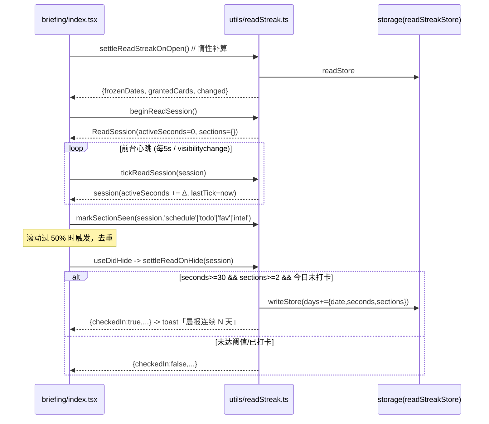
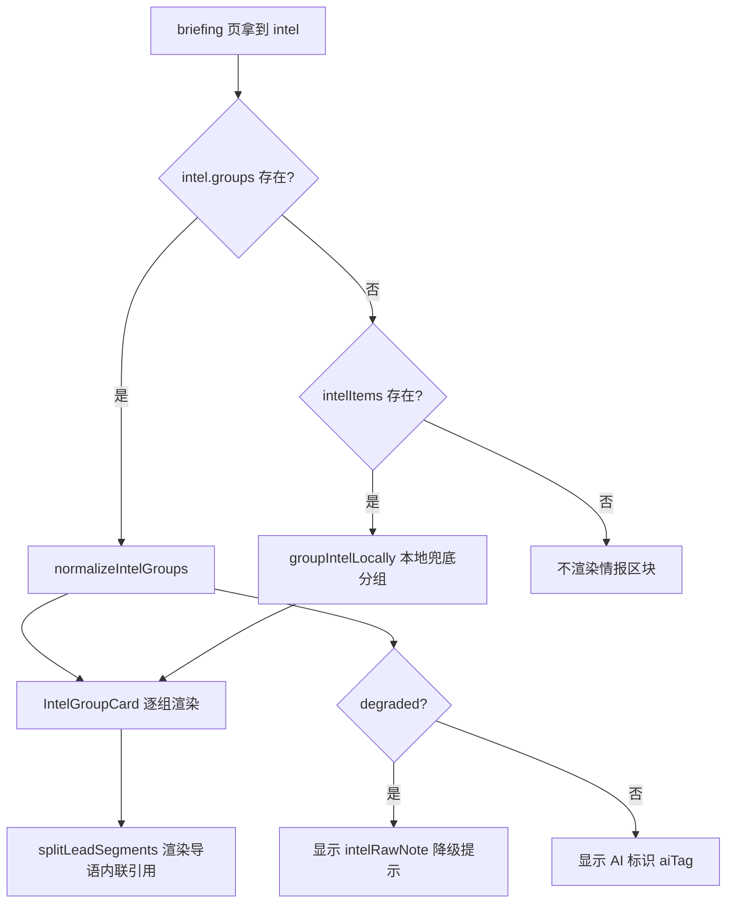
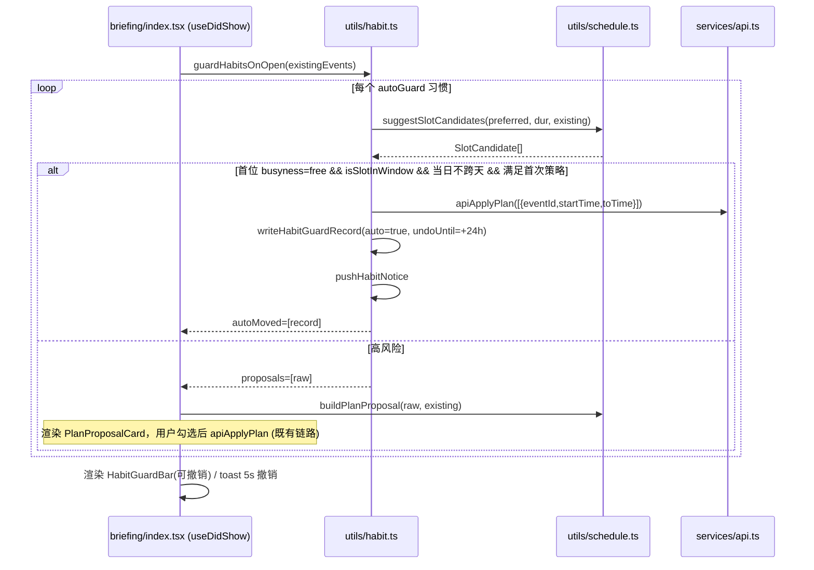
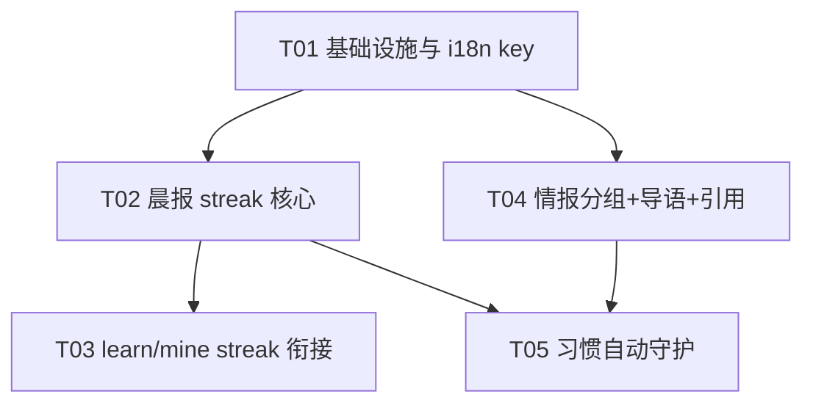

# 阶段 2 战略级增量 · 架构设计文档

> 作者：高见远（Architect）｜目标：私人晨报助理（Taro 4.1.9 + React 18 + TS，weapp + H5 双端）
> 范围：① streak 改挂「每日读晨报」 ② 晨报主题分组 + 导语 + 内联引用 ③ 习惯自动守护
> 本文件只出设计，不含实现代码。可给类型定义/函数签名片段。

---

## 1. 总体结论：实施顺序

| 顺序 | 增量 | 理由 |
|---|---|---|
| **第 1** | 增量 1 · streak 改挂晨报 | 纯前端、零云函数改动、零新增依赖；独立 storage key 与既有 learn streak 解耦，风险最低；是另两项的「计量底座」（习惯守护也要"今天是否履约"的日粒度记录）。 |
| **第 2** | 增量 2 · 主题分组 + 导语 + 内联引用 | 依赖云函数 `webSearch` 的 `briefing` action 契约扩展；前端分组纯函数可先落地并对旧数据降级。改动面大但完全隔离在 briefing 渲染链路。 |
| **第 3** | 增量 3 · 习惯自动守护 | 依赖最重：既有 `ScheduleEvent` 语义、`PlanProposal` 提议链路、写库通道（`apiApplyPlan`）、以及一个「通知到达」的落点（复用增量 1 的晨报日记录 + 站内信）。风险最高，放最后，能在前两项稳定后接入。 |

依赖关系：**T1 独立 → T2 独立（可与 T1 并行）→ T3 依赖 T1（日记录/通知落点）与 T2（通知可在晨报呈现）**。

---

## 2. 增量 1：streak 改挂「每日读晨报」

### 2.1 方案概述
新建独立模块 `src/utils/readStreak.ts` 与独立 storage key `readStreakStore`（**不改 `learnStore`，不触碰冻结的 `types/index.ts`**）。定义「有效阅读」为**停留时长 ≥ 阈值 且 曝光区块数 ≥ 阈值**的组合判定；briefing 页用 `useDidShow`/`useDidHide` 计时，离开页面时结算一次；旧用户的 `learnStore.streak` **保留冻结**（不迁移、不删），learn 页改为显示学习自己的小计数并标注"已停止计streak"，briefing 页接管主 streak UI。

**「读晨报」判定标准（我的定案）**
- 组合阈值：**单次前台停留 ≥ `READ_MIN_SECONDS=30` 秒** 且 **曝光区块 ≥ `READ_MIN_SECTIONS=2` 个**（区块 = 今日日程 / 待办 / 收藏精选 / 情报，由 IntersectionObserver 或滚动过 50% 标记；H5 用 `IntersectionObserver`，weapp 用 `IntersectionObserver` 的 Taro 同构 API `Taro.createIntersectionObserver`）。
- 防刷：① 同一自然日只结算一次（幂等，`days` 去重）；② **单次停留计时以 30 秒为一段累加，切后台即暂停**，反复开关页只在累计达阈值时才算；③ 曝光区块必须是**不同 kind 的 2 个**（同一区块重复曝光不计），杜绝"停留挂机"；④ 一次会话的中断间隔 < `READ_RESUME_GAP=5` 秒视为同一段连续阅读（避免抖动导致无限接近阈值却永不达成）。
- 理由：单纯"打开即算"违背 Duolingo 结论（虚假活跃）；单纯时长可挂机；单纯曝光可秒划。**时长 + 多区块曝光**同时要求"看了一会儿 + 看了不止一块"，成本低但作弊不划算。

### 2.2 数据契约（定义在 `src/utils/readStreak.ts`）

```ts
/** 打卡日：与 learn.StreakDay 结构对齐，便于未来统一云同步 */
export interface ReadStreakDay {
  date: string;          // 'YYYY-MM-DD'
  frozen?: boolean;      // 由冻结卡补入
  makeup?: boolean;      // 补签补入
  /** 当次结算的实际停留秒数（用于分析，不参与判定） */
  seconds?: number;
  /** 当次曝光的区块数 */
  sections?: number;
}

export interface ReadStreakFreeze {
  cards: number;         // 0~2
  granted: number;
  usedDates: string[];
}

export interface ReadMakeupRecord { month: string; used: number; dates: string[]; }

/** 阅读会话（页面存活期间的内存态，不入 storage） */
export interface ReadSession {
  date: string;
  activeSeconds: number;       // 累计前台秒数
  sections: Set<string>;       // 已曝光区块 kind 去重
  lastTick: number;            // 上次心跳时间戳，用于暂停补偿
}

export interface ReadStreakStore {
  days: Array<string | ReadStreakDay>;
  freeze?: ReadStreakFreeze;
  makeup?: ReadMakeupRecord;
  /** 迁移标记：true 表示已执行过 learn streak 冻结处理（幂等，见 2.3） */
  migratedFromLearn?: boolean;
}
```

### 2.3 数据迁移策略（明确回答）
- **不复用 `learnStore`**：两套语义（学习 vs 阅读）混在一个数组会污染 `getStreak()` 语义，且 `readLearnStore` 的归一化逻辑会强行按 learn 口径处理。
- **旧 learn streak 保留但冻结**：不删除 `learnStore.streak`；仅当首次运行 `readStreak` 模块时执行一次性 `migrateFromLearnStreak()`：若 `learnStore.streak.days` 非空，**不搬运日期**（避免"靠学单词挣的连续"直接冒充读晨报，语义不诚实），只在 UI 上提示"学习连续记录已归档"。写 `readStreakStore.migratedFromLearn = true` 保证幂等。
- **冻结卡/补签**：**不迁移**。旧卡留在 learn 体系（learn 页继续可用）。read streak 从 0 天重新起步，但冻结卡机制**结构上完全复用**（同一套 `cards/granted/usedDates` 语义），只是数据独立。

### 2.4 文件清单

| 文件 | 动作 | 改动内容 |
|---|---|---|
| `src/utils/readStreak.ts` | **新建** | 全部纯函数：读/写 store、会话累计、结算、getStreak、冻结卡、补签、迁移 |
| `src/pages/briefing/index.tsx` | 修改 | 接入 `useDidShow`/`useDidHide` 计时与曝光上报；结算后 toast；页头展示 streak |
| `src/pages/briefing/index.module.scss` | 修改 | 新增 `.readStreak` / `.readStreakFlame` 样式 |
| `src/pages/learn/index.tsx` | 修改 | streak 卡片文案改为「学习连续（已归档）」/ 小计数；停止调用 `settleStreakOnOpen` 对外宣称主 streak（保留内部打卡逻辑不删） |
| `src/pages/mine/index.tsx` | 修改 | 新增只读「阅读连续」行（展示 `getReadStreak()` + 冻结卡数） |
| `src/store/language.ts` | 修改 | 新增 i18n key（见 2.7，zh+en 同加） |

> **不改** `src/utils/learn.ts`（除下方可选只读导出）、**不改** `src/types/index.ts`。
> 若 learn 页需读归档态，可在 `learn.ts` **新增**一个只读函数 `getArchivedStreakInfo()`（不改已有结构，向后兼容）。

### 2.5 接口设计（`src/utils/readStreak.ts`）

```ts
export const READ_STORE_KEY = 'readStreakStore';
export const READ_MIN_SECONDS = 30;
export const READ_MIN_SECTIONS = 2;
export const READ_RESUME_GAP = 5;
export const READ_DAY_LIMIT = 180;

export function readReadStore(): ReadStreakStore;
function writeReadStore(s: ReadStreakStore): void;

/** 页面 useDidShow 调用：新建/恢复会话，返回会话对象（内存态，不落盘） */
export function beginReadSession(date?: string): ReadSession;
/** 页面心跳（如每 5s 或 visibilitychange）：累加 activeSeconds，暂停态由 lastTick 补偿 */
export function tickReadSession(session: ReadSession): ReadSession;
/** 区块曝光上报（滚动过 50%）：写入 session.sections */
export function markSectionSeen(session: ReadSession, kind: 'schedule'|'todo'|'fav'|'intel'): ReadSession;

/** 离开页面/后台时结算：满足阈值则打卡（幂等）。返回是否新打卡成功 */
export function settleReadOnHide(session: ReadSession): { checkedIn: boolean; seconds: number; sections: number };

/** 惰性结算（进页面时）：补算昨日漏打卡 + 发冻结卡，与 settleStreakOnOpen 同构 */
export function settleReadStreakOnOpen(): {
  frozenDates: string[]; grantedCards: number; changed: boolean;
};

export function getReadStreak(): number;
export function isTodayRead(): boolean;
export function getReadFreezeCards(): number;
export function canMakeupRead(): { ok: boolean; date: string | null; reason: 'none'|'exhausted'|'no-miss' };
export function makeupReadMissed(): { ok: boolean; streak: number };

/** 一次性迁移：冻结旧 learn streak（幂等），返回是否本次执行 */
export function migrateFromLearnStreak(): boolean;
```

### 2.6 关键流程：阅读会话计时与结算



### 2.7 i18n key 清单（zh 语义）
```
readStreak.today        今日已读晨报
readStreak.days         {n} 天连续
readStreak.toast        🔥 晨报连续 {n} 天，保持住
readStreak.freezeUsed   昨天用了 1 张冻结卡，连续记录保住了
readStreak.freezeGranted 恭喜，获得 {n} 张冻结卡
readStreak.cardLabel    冻结卡 ×{n}
readStreak.makeup       {n} 天，已补签
readStreak.hint         每天读一读晨报，连续不中断
mine.readStreakTitle    晨报连续阅读
mine.readStreakValue    {n} 天
learn.streakArchived    学习连续（已归档，不再计入主连续）
```

### 2.8 降级与边界
- **双端差异**：`useDidShow`/`useDidHide` 在 weapp 与 H5 均由 Taro 提供（H5 映射到 `visibilitychange`）。weapp 前台心跳用 `setInterval`；H5 额外监听 `document.visibilitychange` 以暂停计时。两者结算入口统一走 `settleReadOnHide`。
- **storage 失败**：读写全 try/catch，失败 `console.warn`，`getReadStreak()` 返回 0，绝不阻断晨报渲染。
- **脏数据**：`days` 内元素可能是 `string`（兼容）或对象，统一经 `toDateStr()` 归一化；非 `YYYY-MM-DD` 的丢弃。
- **防刷**：见 2.1；`settleReadOnHide` 幂等（同日已打卡直接返回 false）。
- **页面计时中断**：`lastTick` 补偿机制——若两次 tick 间隔 > 60s 视为后台，不补计该段（防止锁屏算时长）。

### 2.9 待明确事项
1. 阈值 `30s / 2 区块` 需产品拍板（我建议先取此值，可配置 const 便于调参）。
2. 旧 learn streak 是「保留冻结」还是「迁移天数」——我建议冻结（诚实性优先），需产品确认。
3. 是否需要在「我的」页提供重置/清空阅读连续（类 memory 的清空入口）——建议提供，需拍板。

---

## 3. 增量 2：晨报「主题分组 + 导语 + 内联引用」

### 3.1 方案概述
**两遍合成放在云端**：扩展 `cloudfunctions/webSearch/index.js` 的 `briefing` action，让 LLM 一次产出**分组结构**（group → 导语 + 组内条目，条目带 `ref` 序号），前端只做**渲染 + 容错降级**，不做二次分组。理由：① 主题聚类本质是语义任务，模板/关键词聚类质量差；② 复用既有 `summarize()` 通道，**不新增调用次数**（把"生成 3-5 条短句"升级为"生成 2-4 组，每组导语+条目"），成本几乎不变；③ 离线分组只能靠关键词，Readless 的核心价值恰在语义聚类。**降级路径保留并加强**：LLM 失败/限额时，走 `fallbackIntel()`，用**前端本地关键词分组兜底**或直接平铺（沿用现有 `degraded=true` + `intelRawNote` 渲染）。

### 3.2 数据契约 —— 关键约束：`cloudfunctions/getBriefing` 与 `webSearch` 契约
- `intel` 数据由 `webSearch` 的 `briefing` action 产出，经 `getBriefing.attachIntel()` 原样透传并落库到 `briefings` 集合。
- **云函数侧需改**：`webSearch/index.js` 的 `briefing` 返回值 `data` 增加 `groups` 字段（在 `intelItems` 基础上**新增**，`intelItems` 保留以兼容旧前端/降级）。`getBriefing` 不改（`attachIntel` 透传整包 `payload.data`，自动带上 `groups`）。
- 前端 `BriefingIntel` 位于**冻结的 `src/types/index.ts`**，不能改。故**在 `src/utils/intelGroups.ts` 就近定义扩展类型**，以「宽化读取 + 归一化」方式消费：

```ts
// src/utils/intelGroups.ts
export interface IntelRef { text: string; source: string; }

export interface IntelGroup {
  /** 组标题（主题名，≤12字） */
  title: string;
  /** AI 导语（1-2 句，含内联引用占位），属 AI 生成内容 */
  lead: string;
  /** 组内条目 */
  items: IntelRef[];
  /** 导语内联引用：lead 中 [1][2] 槽位 → items 索引 */
  citations: number[];
}

export interface IntelGroupsPayload {
  groups: IntelGroup[];
  /** 是否降级（沿用 intel.degraded 语义） */
  degraded: boolean;
  /** AI 生成标识（导语为 AI 生成，合规要求） */
  aiMeta?: { version: string; generated: boolean };
}

/** 把云端原始 intel 归一化为可渲染分组；任何缺字段都降级为单组平铺 */
export function normalizeIntelGroups(intel: unknown): IntelGroupsPayload;
/** 前端本地兜底分组（无 groups 时按 source/tag 关键词聚类） */
export function groupIntelLocally(items: IntelRef[]): IntelGroup[];
/** 拆分导语文本为可渲染片段（含内联引用标记），双端安全 */
export function splitLeadSegments(lead: string): Array<{ type: 'text'|'cite'; text: string; index?: number }>;
```

### 3.3 内联引用渲染方案（双端可行）
小程序 `<Text>` 不支持任意 HTML，**方案：分段渲染**。
- `splitLeadSegments(lead)` 将 `"芯片价格回落[1]，利好整机厂[2]"` 解析为 `[{type:'text',text:'芯片价格回落'},{type:'cite',text:'1',index:0},{type:'text',text:'，利好整机厂'},...]`。
- 渲染：外层一个 `<Text>`，内部 **嵌套** 若干 `<Text>` 子节点：普通段 `<Text>{text}</Text>`，引用段 `<Text className={styles.cite} onClick={...}>[1]</Text>`。嵌套 `<Text>` 在 weapp 与 H5 均被 Taro 支持（weapp 的 rich text 替代），**不依赖 `dangerouslySetInnerHTML`**。
- 点击引用 → 滚动/展开对应 `items[index]` 或弹出来源名（合规：来源必须可见，见下）。

### 3.4 文件清单

| 文件 | 动作 | 改动内容 |
|---|---|---|
| `src/utils/intelGroups.ts` | **新建** | 类型 + `normalizeIntelGroups` / `groupIntelLocally` / `splitLeadSegments` 纯函数 |
| `src/components/IntelGroupCard/index.tsx` | **新建** | 单组渲染：标题 + 导语（分段+引用）+ 条目列表 + 来源标注 |
| `src/components/IntelGroupCard/index.module.scss` | **新建** | 卡片样式、`.cite` 内联引用样式 |
| `src/pages/briefing/index.tsx` | 修改 | 情报区块改为消费 `normalizeIntelGroups`；保留 `degraded` 分支渲染 `intelRawNote` |
| `cloudfunctions/webSearch/index.js` | 修改 | `summarize()` → 产出 `groups`；`fallbackIntel()` 输出带 `degraded` 的平铺分组 |
| `src/utils/aiLabel.ts` | 可能修改 | 新增导语 AI 标识构建（若现有 `buildExplicitLabel` 可复用则不改） |
| `src/store/language.ts` | 修改 | 新增 key（见 3.6） |

### 3.5 接口设计（函数签名）
见 3.2 已列。补充：
```ts
// utils/aiLabel.ts 复用/扩展
export function buildIntelLeadLabel(degraded: boolean): string; // 导语合规标识文案（走 i18n key）
```

### 3.6 关键流程：情报分组渲染



### 3.7 i18n key 清单
```
briefing.intelGroupLead      导语标识（AI 生成）
briefing.intelCiteHint       查看引用来源
briefing.intelDegradedGroup  已降级为原始资讯，未做主题归并
```

### 3.8 降级与边界
- **LLM 失败/限额**：`webSearch` 返回 `degraded:true` + `intelItems`（无 `groups`）→ 前端 `groupIntelLocally` 本地关键词兜底分组，仍标 `intelRawNote`。
- **旧缓存晨报**：`getBriefing` 落库的旧 `intel` 无 `groups` → `normalizeIntelGroups` 返回单组平铺，兼容。
- **引用越界**：`splitLeadSegments` 遇到 `[n]` 超出 `items.length` 时降级为纯文本，不报错。
- **合规**：导语属 AI 生成，必须显示 AI 标识（复用 `aiTag` / `aiLabel`）；每条目来源必须可见。

### 3.9 待明确事项
1. 是否接受「LLM 调用次数不变、仅升级 prompt 输出结构」——需确认云端模型对 JSON 分组输出的稳定性；建议加 `safeParse` + 结构校验，失败即降级。
2. 导语长度上限（建议 ≤60 字）与组数上限（建议 2-4 组）需产品拍板。

---

## 4. 增量 3：习惯自动守护

### 4.1 方案概述
新建独立 `Habit` 类型 + 独立 storage（**不在 `ScheduleEvent` 上加字段**——`ScheduleEvent` 定义在冻结的 `src/types/index.ts`，且加了会污染所有日程消费方）。习惯守护采用「**惰性结算 + 显式开启 + 分级策略**」：进 briefing/日程页时调用 `guardHabitsOnOpen(existingEvents)`，检测被侵占的习惯块，**低风险自动挪（复用 `suggestSlotCandidates`），高风险改为生成 `PlanProposal` 走既有确认链路**；自动挪动产生**可撤销记录**（复用 memory 的 5s 撤销同构模式 + 持久化 undo 栈），并通过**站内信**告知（复用 `src/utils/subscription.ts` 的 `pushInboxNotice` 机制，「我的」页已有站内信渲染区）。

### 4.2 「习惯」的表示
独立类型（定义于 `src/utils/habit.ts`），独立 storage key `habitStore`：

```ts
export interface Habit {
  id: string;
  title: string;
  /** 期望时段（分钟粒度，'HH:mm'） */
  preferredStart: string;
  durationMinutes: number;
  /** 允许自动挪动的时段范围（如 08:00-21:00） */
  window: { startHour: number; endHour: number };
  /** 允许跨天顺延 */
  allowDayShift: boolean;
  /** 守护开关（用户显式开启，见 4.3 调和方案） */
  autoGuard: boolean;
  /** 关联的日程事件 id（若习惯已实体化为 ScheduleEvent） */
  eventId?: string;
  createdAt: string;
}

export interface HabitGuardRecord {
  habitId: string;
  date: string;
  /** 原时段 */
  fromTime: string;
  /** 自动挪到的时段 */
  toTime: string;
  /** 侵占者（冲突日程标题） */
  blockedBy: string;
  /** 是否由自动（true）/ 提议（false）产生 */
  auto: boolean;
  /** 可撤销：撤销时限至（ISO，默认挪动后 24h） */
  undoUntil: string;
  createdAt: string;
}

export interface HabitStore {
  habits: Habit[];
  records: HabitGuardRecord[];   // 守护历史（含撤销栈）
  maxRecords: number;            // 上限（常量 HABIT_RECORD_MAX=50）
}
```

> **回答「改不改 `ScheduleEvent`」**：不改。`ScheduleEvent` 在 `src/types/index.ts`（冻结）。习惯用独立 `Habit` + `eventId` 弱关联；挪动最终仍是通过既有写库通道落库，不侵入类型。

### 4.3 自动挪动 vs「提议-确认」——**明确表态（调和方案）**
三者并存，按**用户显式开关 + 风险分级**调和：
1. **必须先显式开启**：`habit.autoGuard` 默认 `false`；用户在「我的」页/习惯管理里逐个开启。**默认不自动** —— 这是自动跳过确认的合法前提（用户事前知悉并授权）。
2. **低风险 → 自动**：仅当候选时段 `busyness === 'free'` **且**落在习惯 `window` 内**且** `!allowDayShift` 仍能找到当日空闲（即不跨天、不撞任何日程）时，才自动挪。此类挪动语义等价于「避开一个纯侵占」，用户损失最小。
3. **高风险 → 提议**：候选全是 `clash`/`crowded`、或需扩窗/跨天时，**不自动**，改为生成 `PlanProposal`（复用 `buildPlanProposal` + `PlanProposalCard`），走 S-01~S-04 既有的「勾选后 `apiApplyPlan`」链路。
4. **首次自动后续提议（可选增强）**：同一习惯首次触发自动，后续同类触发降级为提议——降低"被多次自动修改"的惊扰感。建议默认开启此策略（`HABIT_AUTO_FIRST_ONLY=true`）。

### 4.4 触发时机
**进页面惰性结算**（与 `settleStreakOnOpen` 同构）——理由：① 项目已有此确定的模式，复用心智与代码结构；② 无需云端定时任务管理复杂度；③ 双端一致。在 briefing 页 `useDidShow` 末尾调用 `guardHabitsOnOpen(existingEvents)`。**不新增云端定时任务**（避免 cron 逐用户串行超时风险，与 `attachIntel` 的懒加载策略一致）。

### 4.5 挪到哪（候选时段复用）
**直接复用 `suggestSlotCandidates(startTime, endTime, existing, {extended, habitPeriod})`**：
- `SlotCandidate` 已含 `busyness`(free/clash/crowded) / `reason` / `score` / `bufferMinutes` / `dayShifted`，**足够**。
- 自动挪条件：取 `rankSlots` 首位且 `busyness==='free'` 且落在习惯 `window`。
- 跨天：复用 `pickCandidates` 的次日兜底（`extended` + `dayShifted`），但跨天只在 `allowDayShift=true` 时用于提议，**不自动**。
- **缺口**：`SlotCandidate` 无「是否落在习惯 window 内」字段 → 在 `habit.ts` 内新增纯函数 `isSlotInWindow(candidate, window)` 过滤，**不改 `schedule.ts`**。

### 4.6 通知用户
- **站内信**：复用 `src/utils/subscription.ts` 的 `pushInboxNotice` / `listInboxNotices` 机制（「我的」页已有渲染区）。但 `PriceChangeNotice` 结构专用，故在 `habit.ts` 定义 `HabitNotice` 并经一个**通用化**适配写入同一 storage key，或新增独立 key `mb_habit_notices` + 「我的」页新增区块。**建议独立 key**（避免污染价格通知类型）。
- **晨报内提示**：briefing 页顶部新增一条「习惯已自动守护」提示条（复用 `adaptiveBanner` 样式位），点开可看 `HabitGuardRecord` 明细。
- **不新增订阅消息推送**（避免新增模板 ID 配置与合规审批）。

### 4.7 可撤销
- 每次自动挪动写一条 `HabitGuardRecord`，带 `undoUntil`（默认 24h）。
- **撤销入口**：① 挪动后即时 toast + 5s 内撤销（复用 `memoryToast` 同构模式）；② 24h 内可在「我的」页习惯区块/晨报提示条内一键还原。
- **撤销实现**：`undoHabitGuard(recordId)` 把习惯时段 + 关联日程改回 `fromTime`（经既有写库通道 `apiApplyPlan`）。

### 4.8 文件清单

| 文件 | 动作 | 改动内容 |
|---|---|---|
| `src/utils/habit.ts` | **新建** | `Habit` 类型、store 读写、`guardHabitsOnOpen`、`isSlotInWindow`、撤销、通知 |
| `src/components/HabitGuardBar/index.tsx` | **新建** | 晨报页「习惯已守护」提示条 + 撤销按钮 |
| `src/components/HabitGuardBar/index.module.scss` | **新建** | 样式 |
| `src/pages/briefing/index.tsx` | 修改 | `useDidShow` 调用守护；渲染提示条 |
| `src/pages/mine/index.tsx` | 修改 | 新增「习惯守护」区块：习惯列表、`autoGuard` 开关、守护历史 + 撤销 |
| `src/store/language.ts` | 修改 | 新增 key（见 4.10） |

### 4.9 接口设计（`src/utils/habit.ts`）

```ts
export const HABIT_STORE_KEY = 'habitStore';
export const HABIT_RECORD_MAX = 50;
export const HABIT_UNDO_WINDOW_HOURS = 24;
export const HABIT_AUTO_FIRST_ONLY = true;

export function readHabitStore(): HabitStore;
function writeHabitStore(s: HabitStore): void;

export function listHabits(): Habit[];
export function upsertHabit(h: Habit): Habit;
export function setHabitAutoGuard(id: string, on: boolean): Habit | null;
export function removeHabit(id: string): void;

/** 候选是否落在习惯时段窗口内（纯函数，供自动判定） */
export function isSlotInWindow(c: SlotCandidate, window: Habit['window']): boolean;

/** 进页面惰性结算（同构 settleStreakOnOpen）。auto=true 的已写库，proposal 由调用方渲染 */
export function guardHabitsOnOpen(existing: ScheduleEvent[]): {
  autoMoved: HabitGuardRecord[];
  proposals: PlanProposalRaw[];   // 高风险，交给 buildPlanProposal
  changed: boolean;
};

export function listGuardRecords(): HabitGuardRecord[];
export function undoHabitGuard(recordId: string): Promise<{ ok: boolean }>;
/** 写站内信（独立 key mb_habit_notices） */
export function pushHabitNotice(r: HabitGuardRecord): void;
export function listHabitNotices(): HabitNotice[];
export function markHabitNoticeRead(id: string): void;
```

### 4.10 关键流程：习惯自动守护



### 4.11 i18n key 清单
```
habit.guardTitle       习惯守护
habit.autoGuard        自动守护（被占用时自动挪到空闲时段）
habit.guardedToast     「{title}」已自动挪到 {time}
habit.undo             撤销
habit.undoDone         已还原到原时段
habit.recordBlockedBy  因「{title}」冲突而调整
habit.history          守护记录
habit.none             暂无习惯，添加一个常做的事，被占用时自动腾位置
habit.noticeTitle      习惯已自动调整
mine.habitSection       习惯守护
```

### 4.12 降级与边界
- **storage 失败**：全 try/catch + warn，读失败返回空 store，守护静默跳过。
- **写库失败**：`apiApplyPlan` 失败 → 不写 `HabitGuardRecord`（保证记录与事实一致），仅提示"稍后重试"。
- **重复守护**：同一习惯同一天只守护一次（`records` 内 `habitId+date` 去重）。
- **双端差异**：纯逻辑层无差异；`guardHabitsOnOpen` 用 `useDidShow`（双端一致）。
- **无候选**：`suggestSlotCandidates` 返回空 → 跳过该习惯，不报错。
- **用户手动改过时段**：若习惯关联日程已不在 `preferredStart`，视为用户已手动接管，跳过守护。

### 4.13 待明确事项
1. 「自动」默认关闭是否可接受（我主张必须显式开启，合规且体验安全）——需产品确认。
2. 高风险改提议的**判定边界**（扩窗是否算高风险）需产品拍板；我建议"扩窗=高风险不自动"。
3. 撤销窗口 24h 是否合适（可调 const）。
4. 是否需要"习惯"创建入口（新建/编辑习惯 UI）——本轮若只做守护，需确认习惯从哪来（建议：从已有日程一键"设为习惯"）。

---

## 5. 依赖包
**不需要新增任何 npm 依赖。** 三项增量全部复用既有能力：
- streak：`Taro` / `dayjs`（已有）
- 情报分组：前端纯字符串处理；云端复用既有 `https`/`safeParse`
- 习惯守护：复用 `dayjs` + 既有 `schedule.ts` 候选生成
- 内联引用：Taro 嵌套 `<Text>`（原生支持，无需 rich-text 库）

---

## 6. 跨文件共享约定

| 约定 | 值 |
|---|---|
| read streak storage key | `readStreakStore` |
| habit storage key | `habitStore` |
| habit 站内信 key | `mb_habit_notices` |
| 阅读阈值常量 | `READ_MIN_SECONDS=30` / `READ_MIN_SECTIONS=2` / `READ_RESUME_GAP=5` |
| 习惯撤销窗口 | `HABIT_UNDO_WINDOW_HOURS=24` |
| 情报分组字段 | `intel.groups: IntelGroup[]`，`intel.intelItems` 保留兼容 |
| 内联引用语法 | 导语内 `[n]`，n 为组内 `items` 的 1-based 序号 |
| AI 标识 | 导语必须标 AI 生成（复用 `aiTag` / `AI_LABEL_VERSION`） |
| 常量命名 | 全大写 SNAKE，禁止魔法数字 |
| storage 异常 | 一律 try/catch + `console.warn`，绝不 throw |
| 类型定义位置 | 就近在各自 `src/utils/*.ts` 内；**禁止改 `src/types/index.ts`** |
| i18n | zh + en 必须同时加；`LangKey` 自动收敛 |

---

## 7. 任务分解（≤5 个任务，按依赖排序）

| Task ID | 任务名 | 源文件 | 依赖 | 优先级 |
|---|---|---|---|---|
| **T01** | 项目基础设施与共享约定 | 新增常量/类型骨架文件（`utils/readStreak.ts` 骨架、`utils/habit.ts` 骨架、`utils/intelGroups.ts` 骨架）；`store/language.ts` 新增全部 key（zh+en）；不改配置（无需新增依赖） | — | P0 |
| **T02** | 晨报 streak 改挂（增量 1 核心） | `utils/readStreak.ts` 完整实现、`pages/briefing/index.tsx`（计时+曝光+toast+UI）、`pages/briefing/index.module.scss` | T01 | P0 |
| **T03** | learn/mine 页衔接 streak | `pages/learn/index.tsx`（归档文案）、`pages/mine/index.tsx`（阅读连续只读行） | T02 | P1 |
| **T04** | 晨报主题分组 + 导语 + 内联引用（增量 2） | `utils/intelGroups.ts`、`components/IntelGroupCard/*`、`pages/briefing/index.tsx`（情报区块）、`cloudfunctions/webSearch/index.js` | T01 | P0 |
| **T05** | 习惯自动守护（增量 3） | `utils/habit.ts` 完整实现、`components/HabitGuardBar/*`、`pages/briefing/index.tsx`（守护+提示条）、`pages/mine/index.tsx`（习惯区块） | T01, T02, T04 | P0 |

> T02 与 T04 可并行（均只依赖 T01）；T05 最后（依赖 T02 的日记录/通知落点与 T04 的晨报呈现）。

## 8. 任务依赖图


